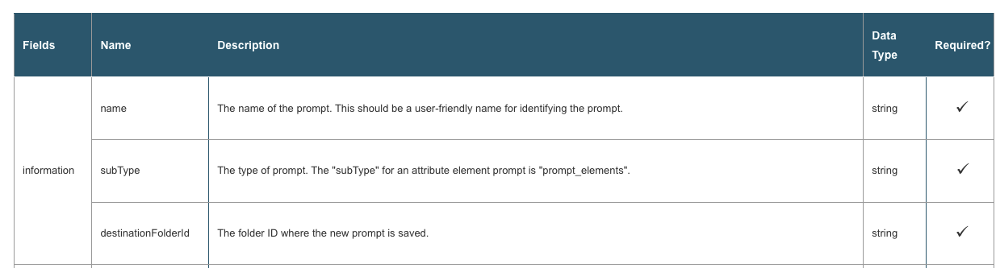
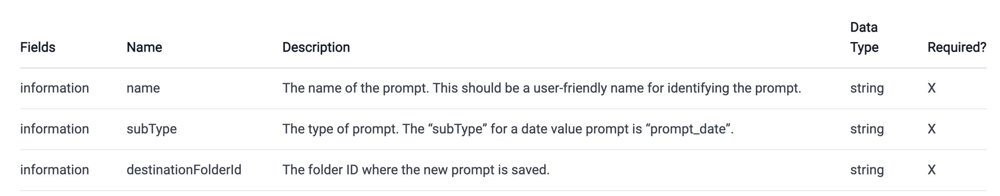
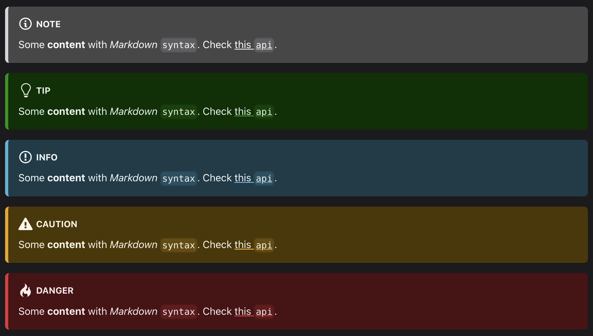
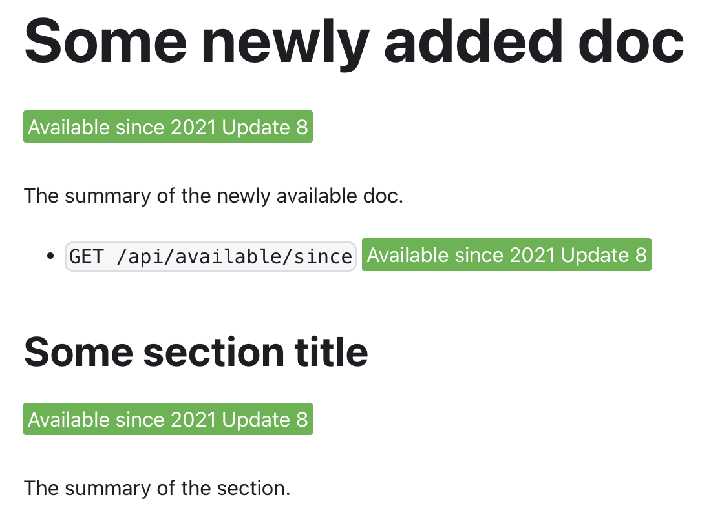
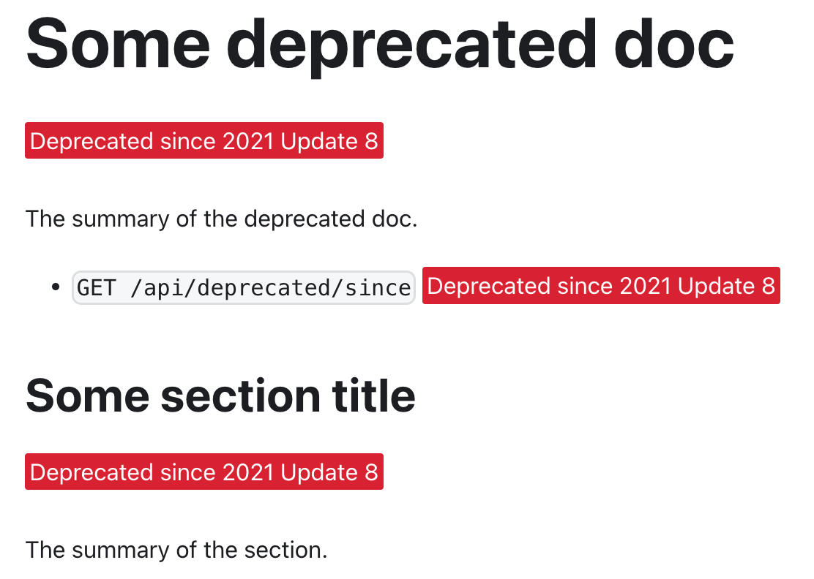

<!-- markdownlint-disable-file MD041 -->

# Content styling guidelines

We try to keep our styling consistent throughout the documentation. Please follow the guidelines to help us provide better documentation.

## Markdownlint

Some rules are enforced by the [`markdownlint`](../.markdownlint.yml).

You can download the [markdownlint linter](https://marketplace.visualstudio.com/items?itemName=DavidAnson.vscode-markdownlint) from the VSCode marketplace, and it will warn you in the markdown files.

To automatically fix these violations when saving a Markdown document, configure Visual Studio Code's [`editor.codeActionsOnSave` setting](https://code.visualstudio.com/docs/getstarted/settings) like so:

```text
"editor.codeActionsOnSave": {
    "source.fixAll.markdownlint": true
}
```

More information about `markdownlint` could be found [here](https://github.com/DavidAnson/markdownlint#rules--aliases).

## Front matter

- (Required) `title` is the `h1` heading that shows as the title of your documentation.
- (Optional) `sidebar_label` is the title you want to show in the sidebar navigation. If the sidebar label is the same as `title`, you can omit this field.
- (Required) `description` is the summary for this page. It provides better text snippet in the search result. This is only for SEO purpose and it won't show up in the documentation. Therefore, If you want the reader see the description, you may want to have the same content of this description in your documentation as well.

Note: Do not use backticks in front matter since they won't be rendered the same as markdown content.

## Headers

Use two hashes (##) for the headers to begin, and continue moving down the line (###, ####, etc.) for subsections.

For headers that need an ordered list, e.g., "1. Do something in this step", it is recommended to write it like `### Step 1: Do something here`, `### 1. Do something here` or something similar instead of `1. ### Do something here` because this would cause the Table of Contents plugin to show the wrong order.

## Code blocks

- Code blocks (not inline code) should be surrounded by three backticks on either side. The language should also be specified after the first three backticks, like so:

  ````text
  ```bash
  code used in the terminal such as curl
  ```

  ```json
  JSON code
  ```

  ```js
  JavaScript code
  ```

  ```javascript
  JavaScript code or JavaScript object. We skip lint for this type of code block. We use it for incomplete JavaScript code, such as JavaScript object.
  ```

  ```xml
  XML code
  ```

  ```java
  Java code
  ```

  ```html
  HTML code
  ```

  ```text
  any other code that is not language-specific
  ```
  ````

Supported languages are listed [here](https://prismjs.com/#languages-list).

- Inline code blocks only need one backtick in front and behind, like so:

  ```text
  `INLINE CODE BLOCK`
  ```

- Inline code that is also a link should not have a backtick so that it still appears blue. Like the following:

  ```text
  [POST /api/auth/login](https://demo.microstrategy.com/MicroStrategyLibrary/api-docs/#!/Authentication/postLogin)
  ```

## Ordered list

It is enforced to use `1.` only for all ordered lists for ease of maintenance.

## Unordered list

It is suggested to use `-` instead of `*`.

## Emojis

Our docs site supports all [Github-supported emojis](https://github.com/ikatyang/emoji-cheat-sheet/blob/master/README.md). Please use it as needed.

The list below shows the usage of emojis in our Docs site:

- `:heavy_check_mark:` for the checkmark in the table.

## Links and images

- Make sure you check that all links and images are still functional after adding them into Markdown. Some of the links have spaces in them, which don’t work in Markdown and should be replaced by a `%20` or the appropriate generated characters (you can use inspect on the page to identify the id/anchor link).

- Images in the `/images` folder are linked relatively. The pathway back can be found by looking at the permalink for the page and backing out until the root folder is reached. For example, if you want to access the images from `playground.md`, you need to access the images like this: ``, and if you want to access the images from `add-functionality/add-event.md`, you need to access the images like this: ``.

- Endpoints for REST API calls should have links if possible.

- For internal links:

  - If the description of the link is related to the title of some page, use sentence case. For example:

    ```md
    [Ability to customize dossier pages from embedding Library home page](./embed-library-main-page/embed-custom-ui-on-all-pages.md)
    ```

  - If the description of the link is in the middle of the sentence and it is a brief explanation of what the link is, use proper cases as needed. For example:

    ```md
    New properties allow you to [customize features and the UI](./add-functionality/methods-and-properties.md) for an embedded dossier.
    ```

## Naming conventions

- Folders and files

  - All folder and file names should have **dashes** (`-`) between **lowercase** letters. There should be no spaces in folder or file names.
  - Permalinks for nested files or folders should recognize the nesting; that is, the permalink should be an relative path from the current folder. For instance, to access `add-functionality/add-event.md` from `add-functionality/add-functionality.md` you would use the link `./add-event.md`.
  - Markdown links should have a `.md` ending to them like `./add-functionality/add-functionality.md`.

- Titles, sidebar labels, and headers

  - These should use **sentence case**. For example, prefer "This is the title from MicroStrategy" over "This Is The Title From MicroStrategy".
  - `sidebar_label` should only be used if you want a different title in the sidebar than the `title` in front matter. (Note: For folders, `label` in sidebars.js takes priority over `sidebar_label`)

## Tables

- The recommended converter could convert the basic HTML table to a Markdown table. However, Markdown doesn’t support merged cells (1 cell in 1 row covers multiple smaller rows). You need to add duplicated entries for the wider row manually).

  For example:

  For the HTML table below,

  

You need to add "information" cell multiple times manually because the converter cannot handle this correctly. It will omit the "information" cell for the following rows to make the table not correct.



- Use `:heavy_check_mark:` instead of `X` to display the checkmarks.

## Admonitions

We use `:::tip` to to provide some tips, `:::info` to provide some extra information, and `:::danger` to let readers to pay more attention in this section.

Examples:

```text

:::note

Some **content** with _Markdown_ `syntax`. Check [this `api`](#).

:::

:::tip

Some **content** with _Markdown_ `syntax`. Check [this `api`](#).

:::

:::info

Some **content** with _Markdown_ `syntax`. Check [this `api`](#).

:::

:::caution

Some **content** with _Markdown_ `syntax`. Check [this `api`](#).

:::

:::danger

Some **content** with _Markdown_ `syntax`. Check [this `api`](#).

:::

```

should be rendered as



## Helpful tags

### Available since tag

If you want to mention that the doc is available since some specific release, you can use the following code snippet:

```jsx
<Available since="2021 Update 8" />
```

If you want to use the same info inline, you can use the following code snippet:

```jsx
<Available since="2021 Update 8" inline />
```

For example:

```md
---
title: Some newly added doc
description: This is a demo of the usage of the available since tag.
---

<Available since="2021 Update 8" />

The summary of the newly available doc.

- `GET /api/available/since` <Available since="2021 Update 8" inline />

## Some section title

<Available since="2021 Update 8" />

The summary of the section.
```

and it will look like this:



### Deprecated since tag

If you want to mention that the doc is deprecated since some specific release, you can use the following code snippet:

```jsx
<Deprecated since="2021 Update 8" />
```

If you want to use the same info inline, you can use the following code snippet:

```jsx
<Deprecated since="2021 Update 8" inline />
```

For example:

```md
---
title: Some deprecated doc
description: This is a demo of the usage of the deprecated since tag.
---

<Deprecated since="2021 Update 8" />

The summary of the deprecated doc.

- `GET /api/deprecated/since` <Deprecated since="2021 Update 8" inline />

## Some section title

<Deprecated since="2021 Update 8" />

The summary of the section.
```

and it will look like this:


