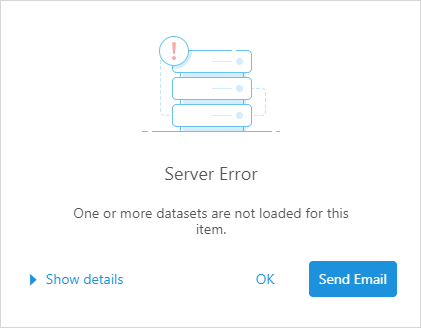

By default, Library displays a pop-up dialog when an error occurs, such as when a dataset is not found.



MicroStrategy provides custom error handling for these kinds of pop-up errors in two stages.

## Error Handling During Dossier Creation

The error handler used during dossier creation in microstrategy.dossier.create is implemented by default. The error handler is executed when the error occurs and you can get details of the error in the customErrorHandler parameter.

```js
microstrategy.dossier.create({
  url: url,
  placeholder: container,
  errorHandler: customErrorHandler,
});
```

To disable the custom error handler during dossier creation, set disableCustomErrorHandlerOnCreate to true. The default setting is false.

```js
microstrategy.dossier.create({
  url: url,
  placeholder: container,
  disableCustomErrorHandlerOnCreate: true,
});
```

## Error Handling After Dossier Creation

You can also provide error handling after the dossier is created. The error handler is executed when the error occurs and you can get details of the error in the `customErrorHandler` parameter.

If you do not configure this error handler and an error is encountered, the default pop-up mentioned at the beginning of this topic appears.

| Class   | Method                                                      | Description                                                                                                                                                                                                                                                                                                                                                                                                                                                                                                         |
| ------- | ----------------------------------------------------------- | ------------------------------------------------------------------------------------------------------------------------------------------------------------------------------------------------------------------------------------------------------------------------------------------------------------------------------------------------------------------------------------------------------------------------------------------------------------------------------------------------------------------- |
| dossier | `addCustomErrorHandler(customErrorHandler, showErrorPopup)` | customErrorHandler(error): The custom error handler that executes when the error occurs. It contains one parameter, error. The error object includes `title`, `message`, `desc`, `errorCode`, `iServerErrorCode`, `statusCode`, and `ticketId`. <br/><br/>showErrorPopup: Set to `false` to disable the error pop-up and execute the custom error handler you provide. <br/><br/>set to `true` to display the error pop-up. When the user clicks OK, instead of going to Library, execute the custom error handler. |
|         | `removeCustomErrorHandler()`                                | Removes the custom error handler and uses the default error pop-up.                                                                                                                                                                                                                                                                                                                                                                                                                                                 |
|         |                                                             |                                                                                                                                                                                                                                                                                                                                                                                                                                                                                                                     |

Here is an example of how to set up error handling:

```js
microstrategy.dossier
  .create({
    placeholder: placeholderDiv,
    url: "http://[host]:[port]/[Library]/app/[ProjectID]/[DossierID]",
    errorHandler: function (error) {
      console.log("catch error during creation: " + error.message);
      //Do something to handle the error
    },
  })
  .then(function (dossier) {
    dossier.addCustomErrorHandler(function (error) {
      console.log("catch error: " + error.message);
      //Do something to handle the error
    });
  });
```
