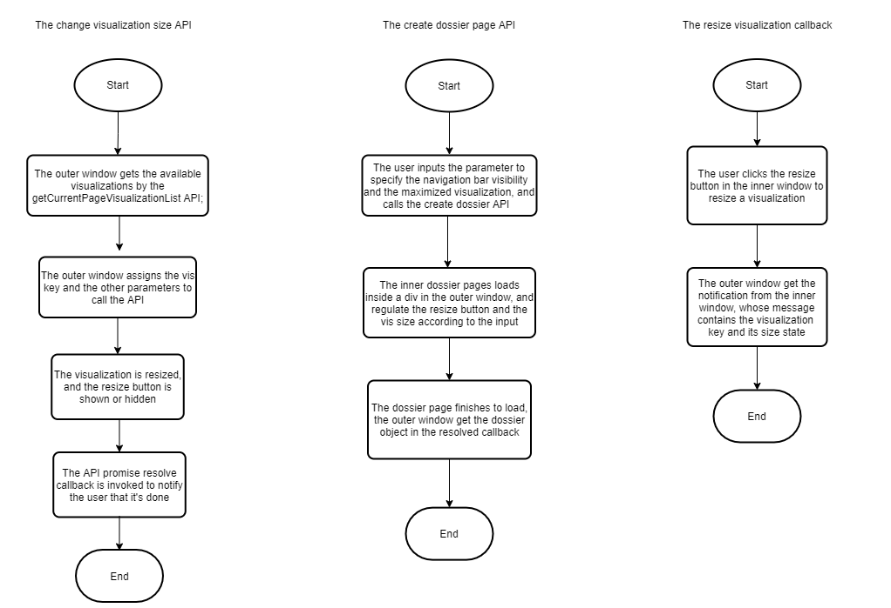

You can use the Embedding SDK to embed a dossier with a single visualization maximized. This gives the appearance of embedding a single visualization onto a page.

This functionality allows you to:

- Target between a maximized view of a single visualization or a normal view of the entire dossier.
- Add event handling so the parent portal is aware of the maximizing action performed by the user.
- Select a single visualization to appear by default when the dossier opens.
- Hide the maximize button so viewers cannot view the entire dossier.
- Choose any visualization on the dossier to appear by default, even if it's not on the current page.

Check out the video below to see how it's done!

<iframe width="556" height="311" src="https://www.youtube.com/embed/S7uYiWo0Zug"
  title="YouTube video player" frameborder="0"
  allow="accelerometer; autoplay; clipboard-write; encrypted-media; gyroscope; picture-in-picture"
  allowfullscreen>
</iframe>

:::tip

To help you get started, we have provided an [example in the Embedding SDK Playground](https://microstrategy.github.io/playground/?example=g15) that will embed a dossier with a single visualization maximized with options to switch between `Max Size` and `Normal Size`.

:::

## Embedding workflow

When initializing a dossier page, you must specify which visualization will be maximized and the visibility of its resize button. When the visualization is resized, whether it's by a manual click or the Embedding SDK, the dossier page raises an event to invoke a callback in your application.



### 1. Change the visualization size

#### Function

`Dossier.changeVisualizationSize(props)`

The `Dossier` object is created using `microstrategy.dossier.create(props)`. See [Methods and properties for an embedded dossier](./methods-and-properties.md) for more information.

#### Input parameters

| Parameter Name              | Description                                                                                                                | Data Type | Required? |
| --------------------------- | -------------------------------------------------------------------------------------------------------------------------- | --------- | --------- | --- |
| `props.visualizationKey`    | The visualization node key entered by you or from the result of `getCurrentPageVisualizationList`.                         | String    | Yes       |     |
| `props.size`                | The visualization sizing of `normal` or `maximized`. If a string is not provided, the visualization size remains the same. | String    | No        |     |
| `props.resizeButtonVisible` | Determines whether the resize button is visible. If a Boolean is not provided, the visibility remains the same.            | Boolean   | No        |

#### Response

This API returns a promise object, similar to:

```js
myDossier &&
  myDossier
    .changeVisualizationSize({
      visualizationKey: "K52",
      size: "maximized",
      resizeButtonVisible: true,
    })
    .then(() => {
      // ...
    })
    .catch((error) => {
      // ...
    });
```

Since the target state is specified in the API parameters, the callback parameters for the resolve case are not necessary.

| Parameter Name | Data Type    | Example                           | Comments                                            |
| -------------- | ------------ | --------------------------------- | --------------------------------------------------- |
| `error`        | Error Object | `new Error("invalid operation!")` | See [API Errors](#api-errors) for more information. |

### 2. Embed the dossier with a single visualization maximized

#### Function

`microstrategy.dossier.create(props)`

#### Input parameters

The `props` parameter contains several fields. See [Methods and properties for an embedded dossier](./methods-and-properties.md) for more information about these fields. In the `props` object, you must add a new optional field called `visualizationAppearances`. The `props` object contains the fields shown below.

| Parameter Name                                          | Description                                                                                                     | Data Type | Required? | Default Value |
| ------------------------------------------------------- | --------------------------------------------------------------------------------------------------------------- | --------- | --------- | ------------- |
| `props.visualizationAppearances[i].visualizationKey`    | The visualization node key input by you.                                                                        | String    | Yes       | N/A           |
| `props.visualizationAppearances[i].size`                | Set to `normal` or `maximized`.                                                                                 | String    | No        | N/A           |
| `props.visualizationAppearances[i].resizeButtonVisible` | Determines whether the resize button is visible. If a Boolean is not provided, the visibility remains the same. | Boolean   | No        | N/A           |

Example:

```js
microstrategy.dossier.create({
  // ...
  visualizationAppearances: [
    {
      visualizationKey: "K52",
      size: "maximized",
      resizeButtonVisible: false,
    },
  ],
});
```

If you don't enter values for `visualizationAppearances`, the dossier runs using the default behavior.

Multiple visualizations are not supported. This is because `size` is coupled on different visualizations, in which only one visualization can be maximized.

#### Response

This API returns a `dossier` promise object in the resolved case, which can be used to call other dossier-owned Embedding SDK APIs.

```js
var placeholderDiv = document.getElementById("dossierContainer");
var myDossier;
microstrategy.dossier
  .create({
    // ...
  })
  .then(function (dossier) {
    myDossier = dossier;
    myDossier.goToNextPage();
    // ...
  });
```

### 3. The resize visualization callback

When a user manually clicks the resize button for a visualization, an event is raised that notifies your application.

#### Event name

`Dossier.onVisualizationResized`

The `Dossier` object is created using `microstrategy.dossier.create(props)`. See [Methods and properties for an embedded dossier](./methods-and-properties.md) for more information.

#### Callback format

In the example below, `registerEventHandler` is an existing API:

```js
myDossier &&
  myDossier.registerEventHandler("onVisualizationResized", function (resizedVisualization) {
    // ... The handling logic after resizing the visualization
  });
```

in which the `resizedVisualization` callback parameter uses the following format:

| Parameter Name         | Description                                                                                                                                                           | Data Type | Sample                                                                       |
| ---------------------- | --------------------------------------------------------------------------------------------------------------------------------------------------------------------- | --------- | ---------------------------------------------------------------------------- |
| `resizedVisualization` | The resized visualization information, similar to:<pre>{<br/> visualizationKey: "string",<br/> size: "maximized" <br/>}<br/></pre> `size` is `normal` or `maximized`. | Object    | <br/><pre>{<br/> visualizationKey: "K52",<br/> size: "maximized"<br/>}</pre> |

## API errors

---

Since you cannot set the callback parameters, it's impossible for these parameters to produce errors. When an error occurs for other reasons, the Embedding SDK returns a promise object that in turn returns an error object in rejected cases. The possible errors are shown below.

| Related APIs                                                                   | Error Case                                                                                                                                                  | Error Handler Callback Parameter | Error Message                                                                                                                                                                                     |
| ------------------------------------------------------------------------------ | ----------------------------------------------------------------------------------------------------------------------------------------------------------- | -------------------------------- | ------------------------------------------------------------------------------------------------------------------------------------------------------------------------------------------------- |
| `Dossier.changeVisualizationSize(props)`                                       | The `visKey` is not a valid visualization key or it is not in the current page or panel stack.                                                              | Error Object                     | There isn’t a visualization whose key is “${0}“. Please check whether your input visKey is correct.                                                                                               |
|                                                                                | The dossier page is still loading.                                                                                                                          |                                  | You couldn’t manipulate a visualization when the page data is not ready. Please wait a few seconds to call this function again.                                                                   |
|                                                                                | The dossier’s manipulation is not finished, so maximize or restore could not be performed. This may occur when the last maximize or restore is in progress. |                                  | You couldn’t resize a visualization when the dossier is busy for loading data.                                                                                                                    |
|                                                                                | Another visualization is already maximized.                                                                                                                 |                                  | Another visualization ${maximizedSiblingKey} is already maximized. Please call dossier.changeVisualizationSize({visualizationKey: "${maximizedSiblingKey}", size: "normal"}) to restore it first. |
|                                                                                | `visualizationKey` is missing.                                                                                                                              |                                  | Invalid input for Dossier.changeVisualizationSize(props): data should have required property 'visualizationKey'                                                                                   |
|                                                                                | `size` is not a valid value.                                                                                                                                |                                  | Invalid input for Dossier.changeVisualizationSize(props): data.size should match pattern "(^(maximized\|normal)$)"                                                                                |
|                                                                                | `resizeButtonVisible` is not a valid value,                                                                                                                 |                                  | Invalid input for Dossier.changeVisualizationSize(props): data.resizeButtonVisible should be boolean                                                                                              |
| `microstrategy.dossier.create(props)` `Dossier.changeVisualizationSize(props)` | `visualizationKey` is missing                                                                                                                               |                                  | Error when valid parameter for microstrategy.dossier.create: data.visualizationAppearances[0] should have required property 'visualizationKey'                                                    |
|                                                                                | `size` is not a valid value.                                                                                                                                |                                  | Error when valid parameter for microstrategy.dossier.create: data.visualizationAppearances[0].size should match pattern "(^(maximized\|normal)$)"                                                 |
|                                                                                | `resizeButtonVisible` isn’t a valid value.                                                                                                                  |                                  | Error when valid parameter for microstrategy.dossier.create: data.visualizationAppearances[0].resizeButtonVisible should be boolean                                                               |
|                                                                                | The value of `visualizationKey` is not a valid visualization key or it is not in the current page or panel stack .                                          |                                  | There isn’t a visualization whose key is '${vizAppearance.visualizationKey}' in the current page. Please check whether your input 'visualizationKey' is correct.                                  |
