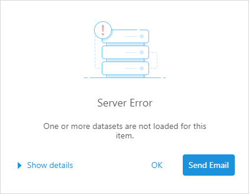
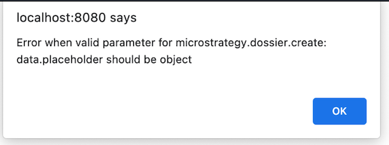

By default, Library displays a pop-up dialog when an error occurs, such as when a dataset is not found.



MicroStrategy provides custom error handling for these kinds of pop-up errors in two stages.

MicroStrategy also provides session error handling for session errors in two stages. Because the handling method of the session error is different from other errors, we don't use the custom error handling in this case.

## Custom error handling

### Custom error handling during dossier creation

The error handler used during dossier creation in microstrategy.dossier.create is implemented by default. The error handler is executed when the error occurs and you can get details of the error in the customErrorHandler parameter.

```js
microstrategy.dossier.create({
  url,
  placeholder: container,
  errorHandler: customErrorHandler,
});
```

To disable the custom error handler during dossier creation, set disableCustomErrorHandlerOnCreate to true. The default setting is false.

```js
microstrategy.dossier.create({
  url,
  placeholder: container,
  disableCustomErrorHandlerOnCreate: true,
});
```

### Custom error handling after dossier creation

You can also provide error handling after the dossier is created. The error handler is executed when the error occurs and you can get details of the error in the `customErrorHandler` parameter.

If you do not configure this error handler and an error is encountered, the default pop-up mentioned at the beginning of this topic appears.

| Class   | Method                                                      | Description                                                                                                                                                                                                                                                                                                                                                                                                                                                                                                         |
| ------- | ----------------------------------------------------------- | ------------------------------------------------------------------------------------------------------------------------------------------------------------------------------------------------------------------------------------------------------------------------------------------------------------------------------------------------------------------------------------------------------------------------------------------------------------------------------------------------------------------- |
| dossier | `addCustomErrorHandler(customErrorHandler, showErrorPopup)` | customErrorHandler(error): The custom error handler that executes when the error occurs. It contains one parameter, error. The error object includes `title`, `message`, `desc`, `errorCode`, `iServerErrorCode`, `statusCode`, and `ticketId`. <br/><br/>showErrorPopup: Set to `false` to disable the error pop-up and execute the custom error handler you provide. <br/><br/>set to `true` to display the error pop-up. When the user clicks OK, instead of going to Library, execute the custom error handler. |
|         | `removeCustomErrorHandler()`                                | Removes the custom error handler and uses the default error pop-up.                                                                                                                                                                                                                                                                                                                                                                                                                                                 |
|         |                                                             |                                                                                                                                                                                                                                                                                                                                                                                                                                                                                                                     |

Here is an example of how to set up error handling:

```js
microstrategy.dossier
  .create({
    placeholder: placeholderDiv,
    url: "http://[host]:[port]/[Library]/app/[ProjectID]/[DossierID]",
    errorHandler(error) {
      console.log(`catch error during creation: ${error.message}`);
      // Do something to handle the error
    },
  })
  .then((dossier) => {
    dossier.addCustomErrorHandler((error) => {
      console.log(`catch error: ${error.message}`);
      // Do something to handle the error
    });
  });
```

### The overall MicroStrategy Library error behavior in embed case

The error generated by the embedded Library or dossier page would output an error log in the browser console. Besides that,

- If `disableCustomErrorHandlerOnCreate` is set to `true` in `microstrategy.dossier.create` or `microstrategy.embeddingContexts.embedLibraryPage`, the custom error handler couldn't be registered. The error would only be shown by a popup error dialog, which is the same as the OOTB MicroStrategy Library behavior;
- If `disableCustomErrorHandlerOnCreate` is not set or is `false`:
  - If a custom error handler is set by `errorHandler` or `addCustomErrorHandler(customErrorHandler, false)`, the error would only invoke the custom error handler and wouldn't popup a Library error dialog.
  - If a custom error handler is set by `addCustomErrorHandler(customErrorHandler, true)`, the error would first popup an error dialog, and when the user clicks the button on the error dialog, the custom error handler would be invoked.
  - If no custom error handler is set, the error would not popup an error dialog. There is no additional effect except the error log in the console.

## Session error handling

When the session expiration error occurs:

- If there is no `sessionErrorHandler` defined, the page will show the Library's logout page.
- If you define a `sessionErrorHandler`, the function will be executed. After 1 minute, the page will forcefully redirect to the OOTB MicroStrategy Library login page.

The differences from custom error handling:

The `sessionErrorHandler` created during dossier creation will not be deleted after dossier creation. It will continue to exist.

There can be only one `sessionErrorHandler` function at the same time, whether during dossier creation or after dossier creation. So if you want to add a new `sessionErrorHandler`, you should use `removeSessionErrorhandler()` to remove the existing `sessionErrorHandler` first.

### Session error handling during dossier creation

The session error handler is executed when the error occurs and you can get details of the error in the `sessionErrorHandler` parameter.

```js
microstrategy.dossier.create({
  url,
  placeholder: container,
  sessionErrorHandler: (errorObject) => {
    // The handling logic of the user
  },
});
```

In the `sessionErrorHandler`, the API user is responsible for re-logging in, and refreshing the dossier page. It could be done by triggering the original embedding logic, like calling `microstrategy.dossier.create()` again. The different authentication methods could be seen on the page [Support for different authentication environments](../support-for-different-authentication-environments/support-for-different-authentication-environments.md).

### Session error handling after dossier creation

You can also provide a session error handler after the dossier is created. The session error handler is executed when the session expiration error occurs and you can get details of the error in the `sessionErrorHandler` parameter.

If you do not configure this error handler and an error is encountered, the default pop-up mentioned at the beginning of this topic appears.

| Class   | Method                            | Description                                                                                                                                                                                                                                                             |
| ------- | --------------------------------- | ----------------------------------------------------------------------------------------------------------------------------------------------------------------------------------------------------------------------------------------------------------------------- |
| dossier | `addSessionErrorHandler(handler)` | addSessionErrorHandler(error): The session error handler that executes when the session expiration error occurs. It contains one parameter, error. The error object includes `title`, `message`, `desc`, `errorCode`, `iServerErrorCode`, `statusCode`, and `ticketId`. |
|         | `removeSessionErrorhandler()`     | Removes the session error handler.                                                                                                                                                                                                                                      |

Here is an example of how to set up error handling:

```js
microstrategy.dossier
  .create({
    placeholder: placeholderDiv,
    url: "http://[host]:[port]/[Library]/app/[ProjectID]/[DossierID]",
    sessionErrorHandler(error) {
      console.log(`catch session expiration error during creation: ${error.message}`);
      // Do something to handle the session expiration error
    },
  })
  .then((dossier) => {
    // if you want to add a new sessionErrorHandler(), you should remove the existing sessionErrorHandler() first
    dossier.removeSessionErrorhandler();
    dossier.addSessionErrorHandler((error) => {
      console.log(`catch session expiration error: ${error.message}`);
      // Do something to handle the session expiration error
    });
  });
```

## Error handling way in Embedding SDK when checking input params

When using the Embedding SDK to embed a page by calling APIs, we will check the user input first. Different from other types of errors, for the input params error, under the default settings, we will directly pop up a pop-up window, so that users can get the most direct error feedback when developing code. It will throw an error after you click the OK button of this window, you can get it by adding a `catch` outside the called API.



If you don't want to see this pop-up window, you can close the pop-up window by adding `disableErrorPopupWindow` parameter to the input. It will notify you of this error by throwing an error directly.
