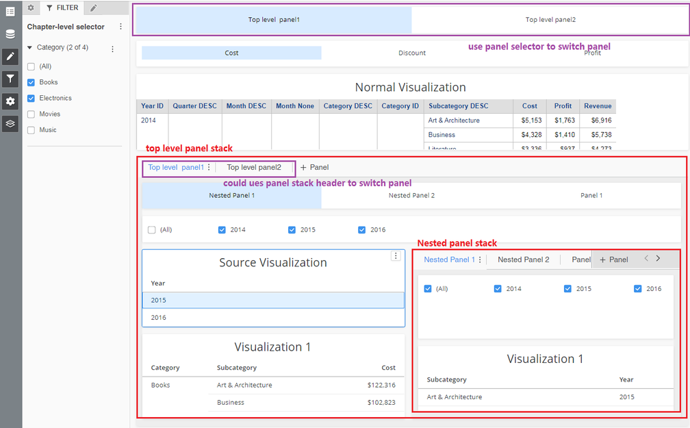
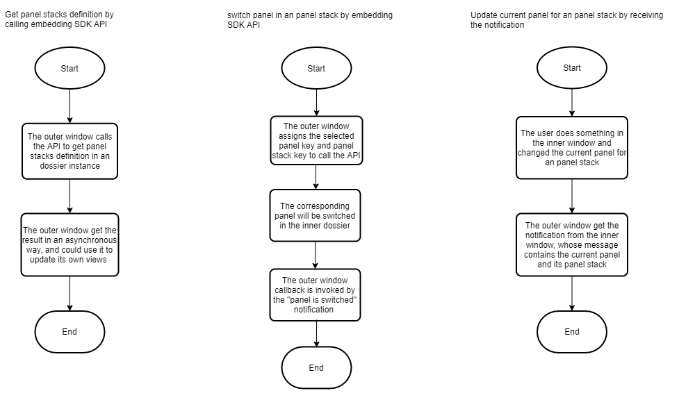

The MicroStrategy 2021 Update 1 release exposed [panel stacks](https://www2.microstrategy.com/producthelp/2021/Workstation/WebHelp/Lang_1033/Content/panel_stacks.htm) within dossiers. This provides end users with the ability to conveniently reuse segments of space within a dashboard to represent data in multiple ways. To provide continuity with our existing APIs and enable embedded applications to take advantage of this new design concept, we have updated existing endpoints and provided new Embedding SDK functions.

MicroStrategy supports one level of nesting within panel stacks. You can switch panel stacks by using a selector or the panel stack header.



Similar to providing navigation capabilities through provided embedded SDK functions, an application can now develop external controls to paginate through the various displays within a panel stack. In addition, if the panel stack is switched by a user's manual input, an event handler notifies the parent application of this action, allowing it to perform filtering or any other desirable action.

:::tip

To help you get started, we have provided an [example in the Embedding SDK Playground](https://microstrategy.github.io/playground/?example=g23) that will embed a dashboard with a panel stack and the option to switch between panels.

:::

## Embedding behavior details

1. Develop a JavaScript function call to support programmatic pagination through a given panel stack. This approach is similar to what is currently done for page navigation. This involves the following:
   1. Go to a specific panel, based on the panel identifier (key)
   1. Get the current panel identifier
   1. Get the available panels
1. Provide a JavaScript event handler to notify the parent application when the visible panel in a panel stack is changed. This approach should mimic the `pageSwitched` handler that currently exists for page navigation.

1. Use hooks to interact or switch to the selected panel. This should work in both situations where a separate panel selector exists and when a normal panel selector exists in the panel header.
1. Incorporate the ability to register and unregister events for callback. This enables the parent application to know when a panel stack is switched and provide information about the new panel stack.

## Embedding workflow



### 1. Get the panel stack definitions from the current page

#### Function

`Dossier.getCurrentPagePanelStacks()`

#### Input parameters

none

#### Response

This API returns a promise object, similar to:

```js
myDossier &&
  myDossier
    .getCurrentPagePanelStacks()
    .then((currentPagePanelStacks) => {
      // ...
    })
    .catch((error) => {
      // ...
    });
```

In which the callback parameters are:

- `currentPagePanelStacks`

  The panel stack definitions on the current page. Its format is similar to the example shown below.

  ```json
  [
    {
      "key": "{panel stack key}",
      "name": "{panel stack name}",
      "currentPanel": "{current panel key}",
      "panels": [
        {
          "key": "{panel key}",
          "name": "{panel name}",
          "panelStacks": [
            {
              "key": "{nested panel stack key}",
              "name": "{nested panel stack name}",
              "currentPanel": "{current panel key}",
              "panels": [
                {
                  "key": "{panel key}",
                  "name": "{panel name}"
                }
              ]
            }
          ]
        }
      ]
    }
  ]
  ```

  **Data Type**

  `Object`

  **Sample**

  ```json
  {
    "panelStackKey": "W61",
    "currentPanel": "W63"
  }
  ```

- `error`

  Error information

  **Data Type**

  `Error Object`

  **Sample**

  Error Message(`error.message`):

  "You couldn’t get the current page panel stacks or switch to a panel when the page data is not ready. Please wait a few seconds to call this function again."

### 2. Switch panels on the current page

#### Function

`Dossier.switchPanel(panelKey)`

:::tip

The `Dossier` object is created using `microstrategy.dossier.create(props)`. See [Methods and properties for an embedded dashboard](./methods-and-properties.md) for more information.

:::

#### Input parameters

- `panelKey`

  The panel key from the result of `getCurrentPagePanelStacks`.

  **Data Type**

  `String`

  **Required?**

  Yes

  **Sample**

  "W63"

#### Response

This API returns a promise object, similar to:

```js
myDossier &&
  myDossier
    .switchPanel(panelKey)
    .then((switchedPanel) => {
      // ...
    })
    .catch((error) => {
      // ...
    });
```

in which the callback parameters are:

- `switchedPanel`

  The switched panel information, in the format shown below.

  ```json
  {
    "panelStackKey": "panel stack key",
    "currentPanel": "current panel key"
  }
  ```

  **Data Type**

  `Object`

  **Sample**

  ```json
  {
    "panelStackKey": "W61",
    "currentPanel": "W63"
  }
  ```

- `error`

  Error information

  **Data Type**

  `Error Object`

  **Sample**

  Error Message(`error.message`):

  "You couldn’t get the current page panel stacks or switch to a panel when the page data is not ready. Please wait a few seconds to call this function again."

### 3. Raise a switch panel event

If the panel is switched in an inner or outer window, it raises a switch panel event that enables you to listen for it. The event detail is shown below.

```json
// event: onPanelSwitched
// event payload:
{
  "panelStackKey": "panel stack key",
  "currentPanel": "current panel key"
}
```

### 4. Modify the select visualization callback data

You must also change the callback data of the existing `ON_VIZ_SELECTION_CHANGED` event. Before any changes, the data returned from the event is similar to that shown below.

```json
{
  // Chapter key
  "K32": {
    // Visualization key
    "K62": true
  }
}
```

This data only contains the selected visualization key and chapter key. If the visualization is inside a panel, you need to provide the panel and panel stack information for it.

You can add code to invoke the callback:

```js
myDossier &&
  myDossier.registerPanelSwitchEventHandler("onVizSelectionChanged", (selectedVis) => {
    // The handling logic
    // ...
  });
```

in which the data format of selectedVis is similar to:

```json
{
  "K32": {
    "K62": true,
    "visualizationLocation": {
      "K62": {
        "pageKey": "K53",
        // If the visualization is not in a panel, it is undefined.
        "panelStackKey": "W110",
        // If the visualization is not in a panel, it is undefined.
        "panelKey": "W113"
      }
    }
  }
}
```

## Embedding SDK errors

Since you cannot set the callback parameters, it's impossible for these parameters to produce errors. When an error occurs for other reasons, the Embedding SDK returns a promise object that in turn returns an error object in rejected cases. The possible errors are shown below.

### Dossier.getCurrentPagePanelStacks()

#### Error case: The API was called while the page was still loading

##### Error handler callback parameter

`Error Object`

##### Error message

You couldn’t get the current page panel stacks or switch to a panel when the page data is not ready. Please wait a few seconds to call this function again.

### Dossier.switchPanel(panelKey)

#### Error case: The panelKey is missing

##### Error handler callback parameter

N/A

##### Error message

The panel key can not be empty!

#### Error case: The panelKey is invalid. It does not exist or it is not in the current page

##### Error handler callback parameter

N/A

##### Error message

There isn’t a panel whose key is `${panelKey}` in the current page and selected panels. Please check whether your input parameter of `switchPanel` function is correct.

#### Error case: The API was called while the page was still loading and users cannot switch panels by manually clicking on them

##### Error handler callback parameter

N/A

##### Error message

You couldn’t switch a panel when the dashboard is busy for loading data. Please wait for a while...

#### Error case: REST API error

##### Error handler callback parameter

N/A

##### Error message

The manipulation API has encountered an error when switching to panel `${panelKey}`. Please try again later.
