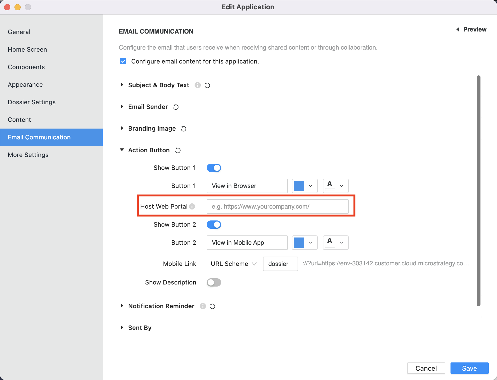

In a client application that embeds a dossier page, if you want the share link in the embedded dossier page to be the client application URL instead of the embedded dossier URL, you need to configure the "Host Web Portal" in the client application settings:



If you set the "Host Web Portal" value to be the URL of the client application, when you share the dossier via email:


The link in the email would be a url like:

```url
http://{hostWebPortal}?mstrLibraryLink=https%3A%2F%2Fdemo%2Emicrostrategy%2Ecom%3A8080%2FMicroStrategyLibrary%2Fapp%2F9D8A49D54E04E0BE62C877ACC18A5A0A%2F0627433046E1B80BCE681C87E48F5C28%2Fbookmarks%3Fids%3D77776092475755EE696EEABF94CF3A61
```

You can see it's the client application URL, not the embedded dossier URL. However, in this URL, the url-encoded result of the embedded dossier url is still stored in the value of the query parameter `mstrLibraryLink`. In the above case, it's the url-encoded result of

```url
https://demo.microstrategy.com:8080/MicroStrategyLibrary/app/9D8A49D54E04E0BE62C877ACC18A5A0A/0627433046E1B80BCE681C87E48F5C28/bookmarks?ids=77776092475755EE696EEABF94CF3A61
```

So the client application could use this URL to recover the status of the embedded dossier page. It could get the embedded dossier url via the parameter `mstrLibraryLink` like this:

```js
// The original embeded dossier URL. Would be used if there is no "mstrLibraryLink" parameter
let dossierUrl =
  "https://demo.microstrategy.com:8080/MicroStrategyLibrary/app/9D8A49D54E04E0BE62C877ACC18A5A0A/0627433046E1B80BCE681C87E48F5C28";
// The logic to get the embedded dossier URL
const url = new URL(location.href);
const mstrLibraryLink = url.searchParams.get("mstrLibraryLink");
// Use this URL to replace the original URL if you want
if (mstrLibraryLink) {
  dossierUrl = mstrLibraryLink;
}

microstrategy.dossier.create({
  url: dossierUrl,
  placeholder: document.getElementById("containerA"),
});
```
