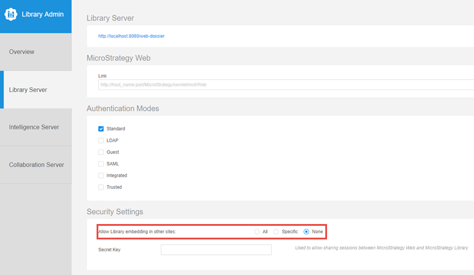
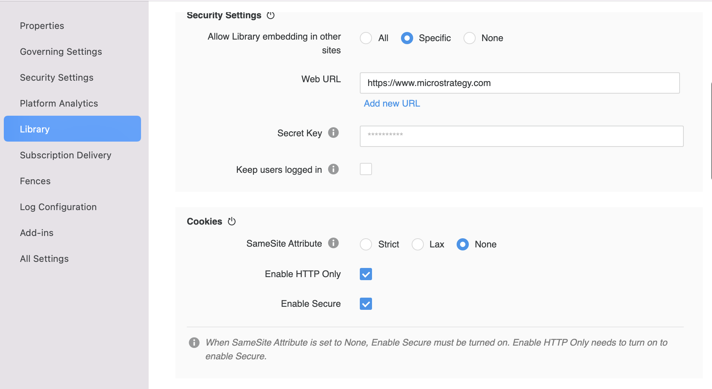

If you plan to use Embedding SDK on a different domain from your MicroStrategy environment, please also meet the following requirements.

## Enable Cross-Origin Resource Sharing (CORS)

Cross-Origin Resource Sharing (CORS) provides a way for a web application running in one origin (domain, protocol, and port) to access selected resources from a server in a different origin. A cross-origin HTTP request uses additional HTTP headers to tell the browser to let the web application share resources. For security reasons, browsers restrict cross-origin HTTP requests initiated from within scripts. This means that when a web application requests HTTP resources from a different origin, the response from the other origin must include the right CORS headers.

:::note

Chrome Web Browser version 80 and above introduces new changes which may impact embedding. For more information, see [KB484005: Chrome v80 Cookie Behavior and the Impact on MicroStrategy Deployments](https://community.microstrategy.com/s/article/Chrome-v80-Cookie-Behavior-and-the-impact-on-MicroStrategy-Deployments).

:::

To enable CORS for the REST Server:

1. Open the Library Admin page. Your URL should be similar to the following:

   `https://<host_name>:<port>/MicroStrategyLibrary/admin`

1. Navigate to **Library Server -> Security Settings**.
1. Choose the appropriate setting for **Allow Library embedding in other sites** to reconfigure CORS.

   

Using the Library Admin page is the easiest way to enable CORS for the REST Server, but you can also configure CORS manually.

1. Navigate to `MicroStrategyLibrary/WEB-INF/classes/config/configOverride.properties`.
1. Edit the `configOverride.properties` file in a text editor.
1. Add the following lines, or replace them if already present:

   `auth.cors.origins=http://example.com:port`

   `security.allowedOrigins=http://example.com:port`

1. Restart your MicroStrategy Library web application hosted on the application server.

Alternatively, you can also configure this in MicroStrategy Workstation by [editing the properties of the environment](https://www2.microstrategy.com/producthelp/Current/Workstation/WebHelp/Lang_1033/Content/library_admin_settings.htm#View).

## Allow SameSite cookies

Google Chrome (version 80+) and Microsoft Edge (version 86+) introduced new changes that may impact embedding.

For Embedding SDK to function as expected in a 3rd-party context, it is required to explicitly label session cookies with `SameSite=None; Secure`.

### For MicroStrategy 2021 Update 6 or after

Starting in MicroStrategy 2021 Update 6, you can manage SameSite Cookies for Library in Workstation, by following the steps in [this document](https://www2.microstrategy.com/producthelp/Current/Workstation/WebHelp/Lang_1033/Content/config_samesite_cookies.htm).



### For MicroStrategy 2021 Update 5 or before

If you are using MicroStrategy 2021 Update 5 or before, make the following changes on your server instance.

1. If `context.xml` doesn't already exist in the following folder location, create it: `[Tomcat Folder]\webapps\MicroStrategyLibrary\META-INF\context.xml`. Add the following to `context.xml`:

   ```xml
   <Context>
      <CookieProcessor sameSiteCookies="None"/>
   </Context>
   ```

1. In `[Tomcat Folder]\webapps\MicroStrategyLibrary\WEB-INF\web.xml`, change `sameSite` param-value blow to `NONE` to permit embedding.

   ```xml
   <!-- ... -->
   <filter>
   <filter-name>cookieProcessorFilter</filter-name>
   <filter-class>com.microstrategy.web.filter.CookieProcessorFilter</filter-class>
   <init-param>
   <param-name>sameSite</param-name>
   <param-value>NONE</param-value>
   </init-param>
   </filter>
   <!-- ... -->
   ```

1. Ensure your Tomcat is configured to support HTTPS.
1. Restart Tomcat.

For more information, see [Chrome v80 Cookie Behavior and the Impact on MicroStrategy Deployments](https://community.microstrategy.com/s/article/Chrome-v80-Cookie-Behavior-and-the-impact-on-MicroStrategy-Deployments?language=en_US).
