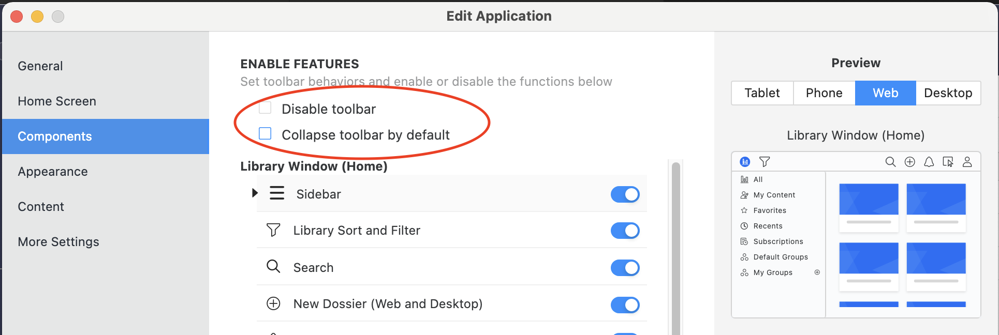
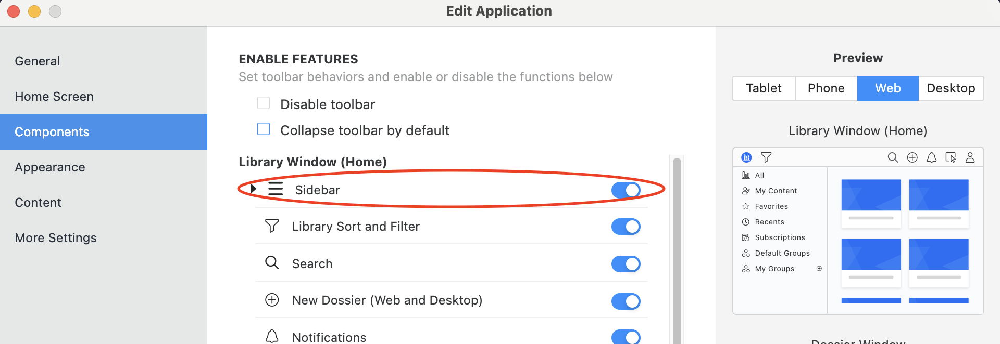

When you embed a MicroStrategy Library home page into a web page, you use the `embedLibraryPage(props)` method under the `microstrategy.embeddingContexts` namespace.

## Method

### `microstrategy.embeddingContexts.embedLibraryPage(props)`

This method creates an iFrame on the web page (in the location specified by the `placeholder` property) and inserts a link to the MicroStrategy Library home page URL (specified by the `serverUrl` property).

#### Return value

This method returns a promise, which is resolved when the MicroStrategy Library home page is loaded.

The `props` parameter contains required key:value pairs that defines the Library Server URL and the `<div>` placeholder where the iFrame containing the MicroStrategy Library home page will be created. It can also contain other optional key:value pairs to customize the UI, authentication and custom error handler.

The `props` parameter could contain the following key:value pairs:

## Properties

### `placeholder`

Reference for the container `<div>`.

#### Required?

Yes

#### Default value

N/A

#### Sample

N/A

### `serverUrl`

`serverUrl` refers to the MicroStrategy Library server URL.

#### Required?

Yes

#### Default value

N/A

#### Sample

```js
microstrategy.embeddingContexts.embedLibraryPage({
  placeholder: placeholderDiv,
  serverUrl: "http://{host}:{port}/{Library}",
});
```

### `containerHeight`

Sets the height of the placeholder.

If the style of the placeholder has a height value, the containerHeight property is ignored.

The `containerHeight` property is applied as a style: style="height: $(containerHeight)".

#### Required?

No

#### Default value

600px

#### Sample

```js
microstrategy.embeddingContexts.embedLibraryPage({
  placeholder: placeholderDiv,
  serverUrl: "http://{host}:{port}/{Library}",
  containerHeight: "600px",
});
```

### `containerWidth`

Sets the width of the placeholder.

If the style of the placeholder has a width value, the containerWidth property is ignored.

#### Required?

No

#### Default value

800px

#### Sample

```js
microstrategy.embeddingContexts.embedLibraryPage({
  placeholder: placeholderDiv,
  serverUrl: "http://{host}:{port}/{Library}",
  containerWidth: "800px",
});
```

### `enableCustomAuthentication`

Specifies whether custom authentication is enabled.

#### Required?

No

#### Default value

`false`

User needs to log in from the default login page.

#### Sample

N/A

### `customAuthenticationType`

Specifies the token type returned by the `getLoginToken` function. There are two possible values, which can be provided by the CustomAuthenticationType enumeration.

#### Required?

No

#### Default value

microstrategy.dossier.CustomAuthenticationType.IDENTITY_TOKEN

#### Sample

N/A

### `getLoginToken`

Specifies a function that returns a promise, which is resolved with either authorization token (`authToken`) or the identity token (`identityToken`) The token type is specified by the customAuthenticationType property.

#### Required?

No

#### Default value

See the sample code in the next column for the default implementation of this function.

#### Sample

When `customAuthenticationType` is set to `CustomAuthenticationType.AUTH_TOKEN`, the following sample demonstrates how to send a fetch request to get `authToken` with your credentials. You can do this using an `XMLHttpRequest`, if your browser does not support `fetch`.

The `getLoginToken` function can be found in [the `getLoginToken` doc](../add-functionality/methods-and-properties#getlogintoken)

```js
microstrategy.embeddingContexts.embedLibraryPage({
  placeholder: placeholderDiv,
  serverUrl: "https://{host}:{port}/{Library}",
  enableCustomAuthentication: true,
  customAuthenticationType: microstrategy.dossier.CustomAuthenticationType.AUTH_TOKEN,
  // The following function is the default implementation. User can provide custom implementation.
  getLoginToken() {
    // The similar logic as getLoginToken in existing Embedding SDK
  },
});
```

When `customAuthenticationType` is set to `CustomAuthenticationType.IDENTITY_TOKEN`, you need to add a component to your web server. Refer to Use Custom Authentication for more information.

### `disableCustomErrorHandlerOnCreate`

To disable the custom error handler, set `disableCustomErrorHandlerOnCreate` to true.

If this flag is set, all the errors occur in the initial loading process and manual actions would be handled by OOTB Library itself, an error dialog would pop up.

You could also refer to [Custom error handling during dashboard creation](../add-functionality/error-handling.md#custom-error-handling-during-dossier-creation) to see the usage of this parameter in `microstrategy.dossier.create`, which has the same effect as in `microstrategy.embeddingContexts.embedLibraryPage` function.

#### Required?

No

#### Default value

false

#### Sample

```js
microstrategy.embeddingContexts.embedLibraryPage({
  serverUrl: url,
  placeholder: container,
  disableCustomErrorHandlerOnCreate: true,
});
```

### `errorHandler`

The custom error handler that executes when the error occurs in the initial loading process. It's a callback function that contains one parameter, `error`. The error object has the property `message`, which contains the detailed error message.

Whether `errorHandler` is set, the error occured inside the library home page would output an error in the browser console. The detailed behavior could be seen in [The overall MicroStrategy Library error behavior in embed case](../add-functionality/error-handling.md#the-overall-microstrategy-library-error-behavior-in-embed-case).

#### Required?

No

#### Default value

N/A

#### Sample

```js
microstrategy.embeddingContexts.embedLibraryPage({
  serverUrl: url,
  placeholder: container,
  errorHandler(error) {
    console.log(`catch error during creation: ${error.message}`);
    // Do something to handle the error
  },
});
```

### `sessionErrorHandler`

The custom error handler that executes when an session expiration error occurs. It's a callback function that contains one parameter, `error`. The error object has the property `message`, which contains the detailed error message.

When session expires:

- If `sessionErrorHandler` is not set, the embedded page would redirect to the OOTB library login page.
- If `sessionErrorHandler` is set, the session error handler would be triggered and the embedded page would not change for 1 minute. If after 1 minute, the error handler doesn't do anything(like reauthentication and refresh page) to renew the session, the embedded page would redirect to the OOTB Library login page.

#### Required?

No

#### Default value

N/A

#### Sample

```js
microstrategy.embeddingContexts.embedLibraryPage({
  serverUrl: url,
  placeholder: container,
  sessionErrorHandler(error) {
    console.log(`catch session error: ${error.message}`);
    // Do something to handle the error
  },
});
```

### `customApplicationId`

Specifies the application that the user wants to show in the embedded page.

The application in MicroStrategy has 2 categories:

- If the application selects library home page as its home screen, the library home page would be embedded with the application's configuration.
- If the application selects a dashboard as its home screen, the embedding would fail and an error would occur.

#### Required?

No

#### Default value

N/A

#### Sample

N/A

### `customUi`

Specifies the custom UI settings on the embedded pages, including MicroStrategy Library home page, dashboard consumption page，dashboard authoring page, and report consumption page.

#### Properties

Please see all the properties in [The customized UI settings in Embedding SDK](./embed-custom-ui-on-all-pages.md)

#### The navigation bar custom setting behavior

The property `customUi.library.navigationBar.enabled` would affect the library home page UI together with the navigation bar setting in the application settings. There are 2 related item in the application settings in MicroStrategy Workstation:

- Disable toolbar
- Collapse toolbar by default



The detailed embedding behavior is as below:

- If `customUi.library.navigationBar.enabled` is false, the navigation bar is disabled by the Embedding SDK settings, and it would never be shown on the embedded library page.

- If `customUi.library.navigationBar.enabled` is true, the setting would still be combined with the settings in the application, to determine the final visibility of the navigation bar:

  - If the current application disables the navigation bar, the navigation bar would never be shown.

  - If the current application enables the navigation bar:

    - If you choose "Collapse toolbar by default" in application settings, the navigation bar is collapsible:

      - If `customUi.library.sidebar.show` is false or not set, on the embedded library page, the navigation bar would be collapsed at the start, and only would be expanded/visible when the user expands it manually.

      - If `customUi.library.sidebar.show` is true, as on the OOTB library page, the sidebar couldn’t be expand unless the navigation bar is visible, the navigation bar would be expanded and shown in this case.

    - If you don't choose "Collapse toolbar by default", the navigation bar would be shown on the embedded library page.

#### The sidebar custom setting behavior

`customUi.library.navigationBar.enabled` would also affect the library home page UI together with the sidebar setting in the application settings:



The special behaviors are as below:

- If sidebar is disabled in the application settings, whether setting `customUi.library.sidebar.show` to true or false, the sidebar couldn't be shown.
- If the navigation bar is enabled in `customUi.library.navigationBar.enabled` and application settings, and "Collapse toolbar by default" is enabled by default, when `customUi.library.sidebar.show` is true, the navigation bar would be expanded and shown.

### `libraryItemSelectMode`

Specifies the library item select mode on the embedded pages, including grid and list views.

#### Required?

No

#### Default value

N/A

#### Allowed values

- single
- multiple

#### Sample

```js
microstrategy.embeddingContexts.embedLibraryPage({
  placeholder: placeholderDiv,
  serverUrl: "http://{host}:{port}/{Library}",
  libraryItemSelectMode: "single",
});
```

### `currentPage`

Specifies the page on the sidebar entries that you want to embed.

`currentPage` format:

```javascript
{
  key: "string",
  targetGroup: {
    id: "string",
    name: "string",
  }
};
```

- `currentPage.key`: This field specifies the key of the page that the user wants to embed. Its available values are the menu items in the sidebar, which could be in ['all', 'myContent', 'favorites', 'recents', 'insights', 'subscriptions', 'defaultGroups', 'myGroups'].

- `currentPage.targetGroup`: This field is only necessary when `currentPage.key` is 'defaultGroups' or 'myGroups', as on library home page the user can't select these 2 menu items but only could select the group items under them. It specifies which group item the user wants to select.

- `currentPage.targetGroup.id`: The id of the group the user wants to select. Its available values could be got from the API `EmbeddingContext.libraryPage.getAllMyGroups()` or `EmbeddingContext.libraryPage.getAllDefaultGroups()`.

- `currentPage.targetGroup.name`: The name of the group the user wants to select.

#### Required?

- `currentPage`: Not required
- `currentPage.key`: Required if `currentPage` is provided
- `currentPage.targetGroup.id` and `currentPage.targetGroup.name`: The user must at least provide one of them. When both of them are provided, `currentPage.targetGroup.id` would have higher priority.

#### Default value

`currentPage.key`: "all"

#### Sample

```js
microstrategy.embeddingContexts.embedLibraryPage({
  serverUrl: url,
  placeholder: container,
  currentPage: {
    key: "myGroups",
    targetGroup: {
      id: "0A88CE2CF43C4242A86A5439850C3EAA",
      name: "GroupA",
    },
  },
});
```
