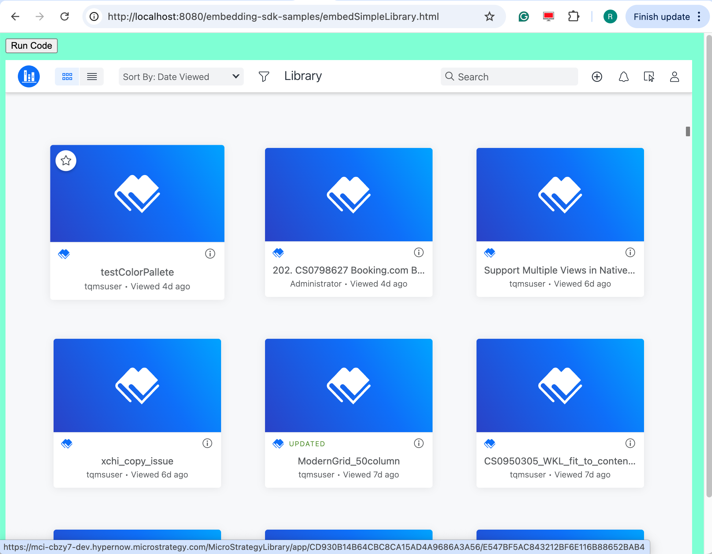
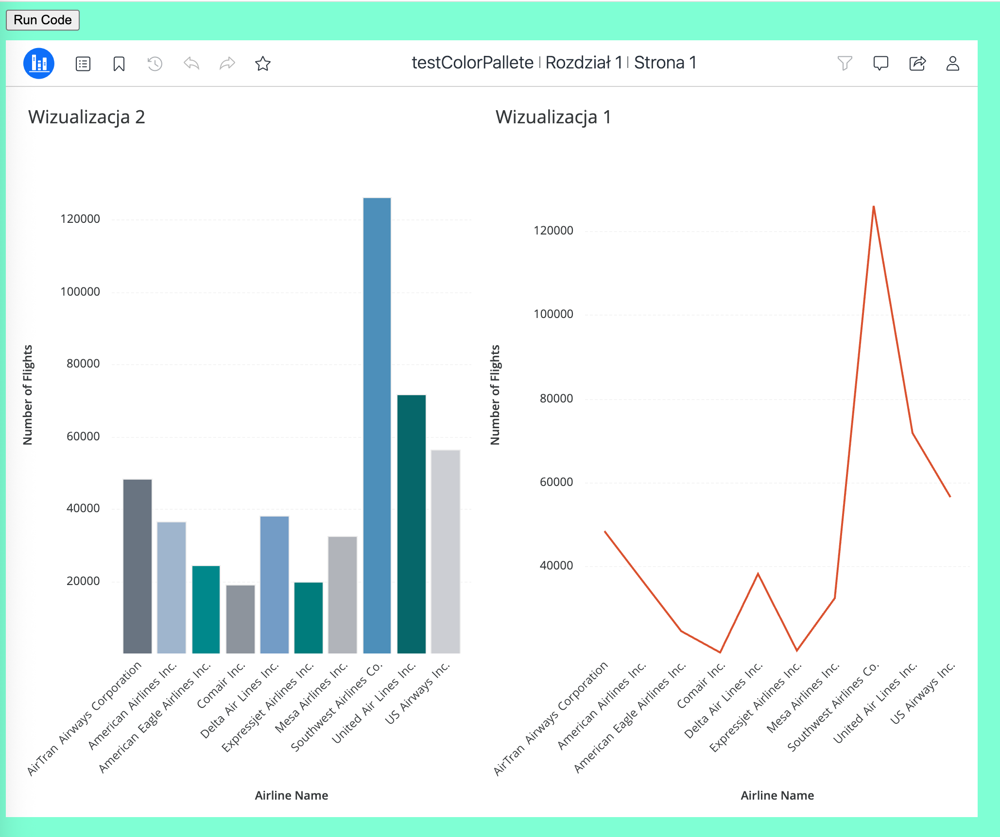

This page introduces a method to improve the embedding performance in a specific case.

## The performance problem in a specific case

In some embedding scenario, the SDK user may want to enter the Library Web home page first, then enter a dossier page from the Library home page:




Though it seems to be the same case as the user clicks a dossier item on home page to enter a dossier page, the SDK user may want to add some custom workflows when switching the pages, like answer prompts for the selected dossier, or add some customizations on the dossier page UI. So the original Library Web's workflow can't satisfy this.

In this case, the SDK user might write his program like this:

```js
const embeddingContext = await microstrategy.embeddingContexts.embedLibraryPage(configA);
// Catch the dossier info when clicking the dossier item on Library homepage
embeddingContext.registerEventHandler(
  microstrategy.dossier.EventType.ON_DOSSIER_INSTANCE_CHANGED,
  async ({ projectId, dossierId, instanceId }) => {
    // Use REST APIs to answer the prompt, or apply the filter
    await answerPromptForInstance(instanceId);
    await applyFilterForInstance(filterContents);
    const dossier = await microstrategy.dossier.create({
      instance: {
        mid: instanceId,
        status: 1,
      },
      ...configB,
    });
  }
);
```

This workflow works but has some performance issue.

That's because the `microstrategy.dossier.create()` API will destroy the original iframe and create a new iframe, so its loading is like open the dossier in a new browser tab, in which we need to fetch all the resources, including the static resources and REST API result again.

In contrary, in a normal Library Web workflow, when the user enters the dossier page from homepage on Library Web, the js context is maintained. All these resources are cached and Library Web doesn't need to load them repeatedly.

## A better solution: Use `goToPage()`

To improve the performance of this use case and gain the similar performance as clicking the dossier item to enter a dossier pages from the Library homepage. You can use the [EmbeddingContext.goToPage()](../embedding-context/#gotopagepageinfo) API like this:

```javascript
const embeddingContext = await microstrategy.embeddingContexts.embedLibraryPage(configA);
// Catch the dossier info when clicking the dossier item on Library homepage
embeddingContext.registerEventHandler(
  microstrategy.dossier.EventType.ON_DOSSIER_INSTANCE_CHANGED,
  async ({ projectId, dossierId, instanceId }) => {
    // Use REST APIs to create the instance and answer the prompt, or apply the filter
    await answerPromptForInstance(instanceId);
    await applyFilterForInstance(filterContents);
    await embeddingContext.goToPage({
      projectId,
      objectId: dossierId,
      instanceId,
      isAuthoring: false,
    });
  }
);
```

The [EmbeddingContext.goToPage()](../embedding-context/#gotopagepageinfo) API will not destroy the current iframe. Its workflow is similar as a simple redirect on the Library Web, so it has the similar performance as entering the dossier page from homepage on Library.

Here are some details about how to use the `goToPage()` to implement the original workflow:

### How to get the dossier instance when the dossier item is clicked

You have 2 ways to get the dossier instance in this workflow:

- If you want to reuse the dossier instance created by the dossier page switch on Library Web, you can use the [ON_DOSSIER_INSTANCE_CHANGED](../add-functionality/add-event#ondossierinstancechanged) event:

```js
embeddingContext.registerEventHandler(
  microstrategy.dossier.EventType.ON_DOSSIER_INSTANCE_CHANGED,
  async ({ projectId, dossierId, instanceId }) => {
    await answerPromptForInstance(instanceId);
    await applyFilterForInstance(filterContents);
    await embeddingContext.goToPage({
      projectId,
      objectId: dossierId,
      instanceId,
      isAuthoring: false,
    });
  }
);
```

- If you want to manage the instance by yourself, or sometimes in the following workflow you still need to create a dossier instance of your own, you can use the [ON_LIBRARY_ITEM_SELECTED](../add-functionality/add-event#onlibraryitemselected) event:

```js
embeddingContext.registerEventHandler(
  microstrategy.dossier.EventType.ON_LIBRARY_ITEM_SELECTED,
  async ({ projectId, docId }) => {
    // Use REST API to create your own instance
    const instanceId = await createDossierInstance(projectId, docId);
    await answerPromptForInstance(instanceId);
    await applyFilterForInstance(filterContents);
    await embeddingContext.goToPage({
      projectId,
      objectId: dossierId,
      instanceId,
      isAuthoring: false,
    });
  }
);
```

### How to monitor the page change

Sometimes the SDK user may have different components on their client page when the inner page is the Library homepage from the components on the dossier page. For example, if the user has a customized "reprompt" button, he might want to show it when the inner page is a dossier page, and hide it when the inner page is Library homepage.

We can use the [ON_DOSSIER_INSTANCE_ID_CHANGE](../add-functionality/add-event#ondossierinstanceidchange) event to monitor the page changes:

```js
embeddingContext.registerEventHandler(
  microstrategy.dossier.EventType.ON_DOSSIER_INSTANCE_ID_CHANGE,
  async (instanceId) => {
    if (instanceId) {
      // A new dossier instance is created. The page is the dossier page
      repromptButton.setVisible(true);
    } else {
      // The instance is deleted. Will go to another page like homepage
      repromptButton.setVisible(false);
    }
  }
);
```

And if the user wants to know when the page render is finished, to make some custom UI changes, like a customized loading bar, he can use the [ON_PAGE_LOADED](../add-functionality/add-event#onpageloaded) event:

```js
embeddingContext.registerEventHandler(
  microstrategy.dossier.EventType.ON_DOSSIER_INSTANCE_CHANGED,
  async ({ projectId, dossierId, instanceId }) => {
    loadingBar.show();
    // Do other things
  }
);
embeddingContext.registerEventHandler(microstrategy.dossier.EventType.ON_PAGE_LOADED, async () => {
  loadingBar.hide();
});
```

### How to maintain the dossier page UI customizations

When you use `microstrategy.dossier.create(props)` API, you may need to do some UI customizations, like hide some buttons on the toolbar:

```js
await microstrategy.dossier.create({
  url: "https://demo.microstrategy.com/MicroStrategyLibrary/app/B7CA92F04B9FAE8D941C3E9B7E0CD754/27D332AC6D43352E0928B9A1FCAF4AB0",
  placeholder: document.getElementById("embedding-dossier-container"),
  navigationBar: {
    enabled: true,
    gotoLibrary: false,
    title: false,
    toc: true,
    reset: true,
  },
});
```

The `goToPage()` function doesn't have such parameters. However, you can set these customization together in the [customUi](../embed-library-main-page/embed-library-properties#customui) parameter when you call the initial `microstrategy.embeddingContexts.embedLibraryPage()` function:

```js
const embeddingContext = await microstrategy.embeddingContexts.embedLibraryPage({
  serverUrl: "https://demo.microstrategy.com/MicroStrategyLibrary",
  placeholder: document.getElementById("embedding-dossier-container"),
  customUi: {
    dossierConsumption: {
      navigationBar: {
        enabled: true,
        gotoLibrary: false,
        title: false,
        toc: true,
        reset: true,
      },
    },
    dossierAuthoring: {
      toolbar: {
        undo: {
          visible: false,
        },
        redo: {
          visible: false,
        },
      },
    },
  },
});
```

Then the UI customization will take effect when you navigate from the Library homepage to a dossier consumption or a dossier authoring page.

### How to use the events and APIs on dossier page

If you use some APIs or events on the dossier page, like:

```js
const dossier = await microstrategy.dossier.create({
  url: "https://demo.microstrategy.com/MicroStrategyLibrary/app/B7CA92F04B9FAE8D941C3E9B7E0CD754/27D332AC6D43352E0928B9A1FCAF4AB0",
  placeholder: document.getElementById("embedding-dossier-container"),
});
dossier.registerEventHandler(microstrategy.dossier.EventType.ON_PAGE_LOADED, async () => {
  loadingBar.hide();
});
document.getElementById("filter-btn").addEventListener("click", async () => {
  await dossier.applyFilter(filterContent);
});
```

You can use the [embeddingContext](../embedding-context) and [embeddingContext.dossierConsumption](../embedding-context/dossier-consumption-page-apis) object to do this, like:

```js
const embeddingContext = await microstrategy.embeddingContexts.embedLibraryPage({
  serverUrl: "https://demo.microstrategy.com/MicroStrategyLibrary",
  placeholder: document.getElementById("embedding-dossier-container"),
});
embeddingContext.registerEventHandler(microstrategy.dossier.EventType.ON_PAGE_LOADED, async () => {
  loadingBar.hide();
});
document.getElementById("filter-btn").addEventListener("click", async () => {
  await embeddingContext.dossierConsumption.applyFilter(filterContent);
});
```
