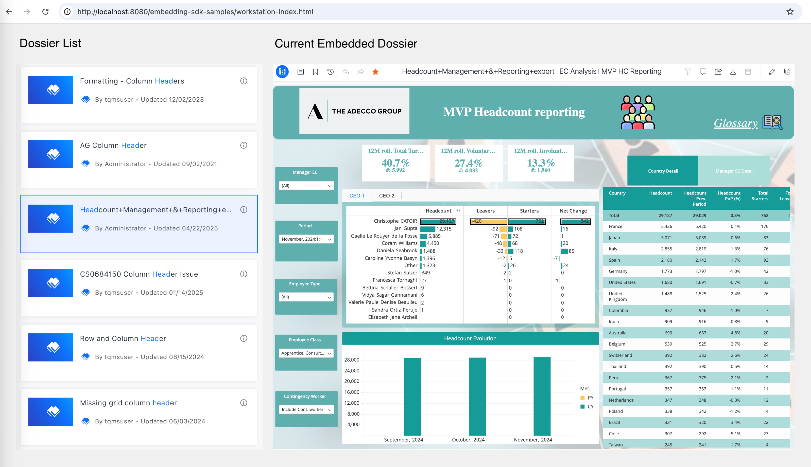

This page introduces a method to improve the embedding performance in a specific case.

## The performance problem in a specific case

Sometimes the user may use a special web page layout like this:



On this web page, the left side is a dossier list, and the right side is a embedded dossier page. The dossier list might be fetched through some REST APIs like `GET /api/searches/results`, and the embedded dossier is normally rendered by calling the Embedding SDK API like `microstrategy.embeddingContexts.embedDossierConsumptionPage()`. When the user changes his selection on the left dossier list, the right side's embedded dossier will also change by calling `microstrategy.embeddingContexts.embedDossierConsumptionPage()` with new dossier id again in the same container.

It's similar as the process that the user first go to the Library homepage, then clicks a dossier item to enter the dossier page. However, if you simply write the program like this:

```javascript
// Assume the parameters can be passed to this function after the user click
async function onDossierListClicked({serverUrl, projectId, dossierId}) {
    await microstrategy.embeddingContexts.embedDossierConsumptionPage({
        serverUrl,
        projectId,
        objectId: dossierId,
        placeholder: document.getElementById("dossier-container"),
        ...
    });
}
```

You will see sometimes the embedded dossier page will be loaded slower than entering the dossier page from the homepage on Library Web.

That's because the `microstrategy.embeddingContexts.embedDossierConsumptionPage()` API call on the same container will destroy the original iframe and create a new one. So its loading is like open the dossier in a new browser tab, in which we need to fetch all the resources, including the static resources and REST API result again. However, when the user enters the dossier page from homepage on Library Web, all these resources are cached and Library Web doesn't need to load them repeatedly.

## A better solution: Use `goToPage()`

To improve the performance of this use case and gain the similar performance as entering dossier pages from the Library homepage, we recommend you use the [EmbeddingContext.goToPage()](../embedding-context/#gotopagepageinfo) API like this:

```javascript
let containerIdToContext = {};
// If necessary, the user can also create instance by himself and pass the instance Id here
async function onDossierListClicked({serverUrl, projectId, dossierId, instanceId}) {
    const containerId = "dossier-container";
    let embeddingContext;
    if (containerIdToContext[containerId]) {
        embeddingContext = containerIdToContext[containerId];
        await embeddingContext.goToPage({
            projectId,
            objectId: dossierId,
            instanceId,
        });
    } else {
        embeddingContext = await microstrategy.embeddingContexts.embedDossierConsumptionPage({
            serverUrl,
            projectId,
            objectId: dossierId,
            placeholder: document.getElementById(containerId),
            ...
        });
        containerIdToContext[containerId] = embeddingContext;
    }
}
```

In this case, the `embeddingContext` can be retained, and the `goToPage()` call is similar as a simple redirect on the Library Web. So it has the similar performance as entering the dossier page from homepage on Library.
