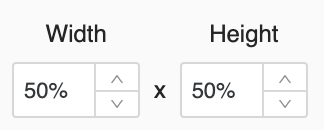
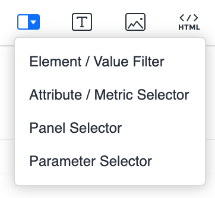

<Available since="StrategyJune 2025"/>

## Overview

The Information Window feature enhances data visualization interactivity by providing contextual details in a dynamic overlay. When a user clicks on a visualization element, a contextual window appears displaying additional information that is automatically filtered based on the selected element.

## Implementation

To implement the Information Window feature, please refer to the [MstrDossier API documentation](mstr-dossier.md) for the required parameters and implementation details.

## Behavior Specifications

### Size Management

The Information Window automatically adjusts its dimensions based on the content and maintains the optimal width-to-height ratio consistent with MicroStrategyLibrary standards:

### Positioning Logic

The Information Window intelligently positions itself relative to the interaction point. When a user clicks on a visualization element, the window appears proximal to the click location while ensuring it remains fully visible within the viewport.

## Technical Limitations

The Information Window feature has specific compatibility constraints:

Certain selector components and filtering mechanisms are not compatible with the Information Window rendering system. For optimal implementation, avoid using these unsupported configurations.
