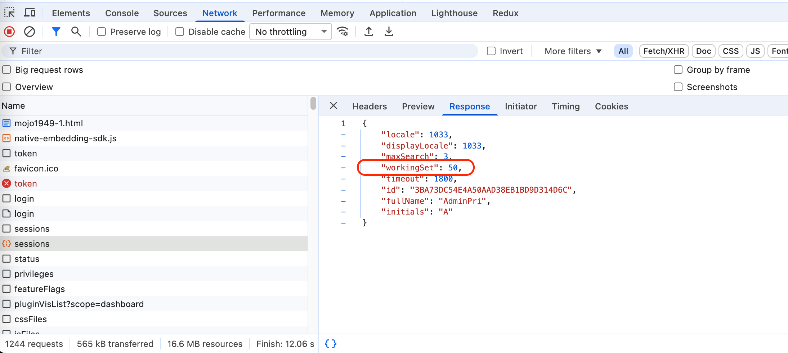

<Available since="Strategy ONE December 2025"/>

### One dashboard owns only one instance

In the normal case, the Native Embedding SDK only creates one `MstrDossier` object for one dashboard object. That is, if you write code like this:

```js
const mstrEnvironment = await microstrategy.embeddingComponent.environments.create({
  serverUrl: configs.serverUrl,
  getAuthToken,
});
const mstrDossierA = await mstrEnvironment.loadDossier({
  projectId: configs.projectId,
  objectId: configs.objectId,
});
// mstrDossierB === mstrDossierA
const mstrDossierB = await mstrEnvironment.loadDossier({
  projectId: configs.projectId,
  objectId: configs.objectId,
});
```

Then `mstrDossierB` will be the same as `mstrDossierA`. They are exactly the same object and share the same dashboard instance. For one dashboard instance, if it renders the visualizations from different pages, like:

```js
await mstrDossierA.refresh([
  {
    key: "K52", // Page 1, viz 1
    container: document.getElementById("container1"),
  },
  {
    key: "W63", // Page 1, viz 2
    container: document.getElementById("container2"),
  },
  {
    key: "W64", // Page 2, viz 3
    container: document.getElementById("container3"),
  },
  {
    key: "R85", // Page 2, viz 4
    container: document.getElementById("container4"),
  },
]);
```

The dashboard will first fetch the page 1 data, render the visualization 1 and 2, and then fetch the page 2 data and render visualization 3 and 4.

This brings a problem: If the user renders the visualizations from many different pages, the visualizations on different pages will render sequentially, which downgrades the performance.

### One dashboard owns only multiple instances

In Strategy ONE December 2025, we support one dossier to have multiple instances, which can render the visualizations from different pages in parallel, and accelerate the rendering speed. The point is, for each page, we can create a `MstrDossier` object that owns an independent dashboard instance, and these instances can be created and fetched data simultaneously.

We need to use a new param `forceCreateNewInstance` in the [loadDossier()](./mstr-environment#the-load-dashboard-api) function to do this:

```js
const environment = await microstrategy.embeddingComponent.environments.create({
  serverUrl,
  getAuthToken,
});

async function refreshDossier(vizAndContainers) {
  const mstrDossier = await environment.loadDossier(
    {
      projectId,
      objectId,
    },
    {
      forceCreateNewInstance: true,
    }
  );
  await mstrDossier.refresh(vizAndContainers);
  return mstrDossier;
}

// Here mstrDossierA !== mstrDossierB
const [mstrDossierA, mstrDossierB] = await Promise.all([
  refreshDossier([
    {
      key: "K52", // Page 1, viz 1
      container: document.getElementById("container1"),
    },
    {
      key: "W63", // Page 1, viz 2
      container: document.getElementById("container2"),
    },
  ]),
  refreshDossier([
    {
      key: "W64", // Page 2, viz 1
      container: document.getElementById("container3"),
    },
    {
      key: "R85", // Page 2, viz 2
      container: document.getElementById("container4"),
    },
  ]),
]);
```

Here `mstrDossierA !== mstrDossierB`. The 2 `refreshDossier()` functions can be executed in parallel, which improves the rendering speed.

### Change the working set limit

On the Strategy iServer, the dashboard instance count limit for each user session is 10 by default. So if the embedding SDK user creates too many dashboard instances on a web page, the former instances might be expired or deleted.

To solve this problem, the user can change the working set limit to a larger number. This could be done by assigning this limit by `workingSet` parameter in the [login API](https://demo.microstrategy.com/MicroStrategyLibrary/api-docs/index.html#/Authentication/postLogin) like:

```js
const mstrEnvironment = await microstrategy.embeddingComponent.environments.create({
  serverUrl: configs.serverUrl,
  getAuthToken: () => {
    const options = {
      method: "POST",
      credentials: "include",
      mode: "cors",
      headers: { "content-type": "application/json" },
      body: JSON.stringify({
        loginMode: 1,
        username: "XXX",
        password: "YYY",
        // Enlarge the working set limit
        workingSet: 50,
      }),
    };
    return fetch(`${configs.serverUrl}/api/auth/login`, options)
      .then((response) => {
        if (response.ok) {
          console.log("A new standard login session has been created successfully, logging in");
          return response.headers.get("x-mstr-authtoken");
        }
        return response.json().then((json) => console.log(json));
      })
      .catch((error) => console.error("Failed Standard Login with error:", error));
  },
});
```

For the other type of authentication methods, like OIDC, you can set the `workingSet` number in the URL query parameter.

### Verify whether the working set limit change succeeds

If you want to check whether your working set limit change is successful, you can open the dev tool and check the GET /api/sessions REST API result:

If the `workingSet` number in the REST API response is the same as the number you set, you setting works in the current session.
