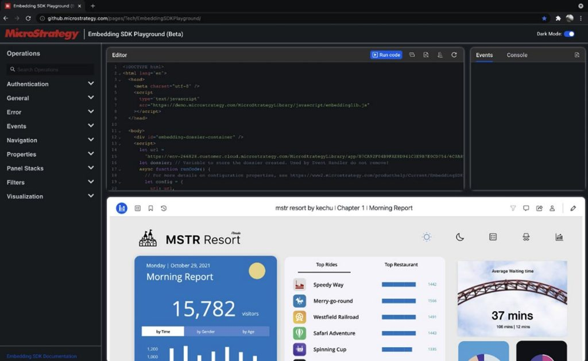

MicroStrategy’s Embedding SDK Playground is the one-stop shop for developers to build impactful, interactive analytics experiences that integrate seamlessly with websites and applications.

Just use the intuitive drag-and-drop interfaces to define the perfect user experience, test it out in real time, and then let the platform automatically generate the code for you. You’ll turn your application into platform for Intelligence Everywhere in no time.

Start building your application using the [Embedding SDK Playground](https://microstrategy.github.io/playground/). The [Playground User Manual](https://github.com/MicroStrategy/playground) provides the instructions for how to get started.

## Examples in Playground

You can view examples in the Embedding SDK Playground by opening the Examples Gallery from "Start Over" button. Please save your work before opening an example.

Here are some examples in the gallery so far.

| Example                    | Use Case                                                                                                                                                                      |
| :------------------------- | :---------------------------------------------------------------------------------------------------------------------------------------------------------------------------- |
| Simple Dossier Example     | How to embed a dossier.                                                                                                                                                       |
| Minimal Template           | A template for the least amount code.                                                                                                                                         |
| Responsive Height          | JavaScript code to make the height responsive.                                                                                                                                |
| Dossier in Full Screen     | How to show embedded dossier in full screen.                                                                                                                                  |
| Inter-dossier interaction  | Interaction between embedded dossier. One dossier filters another.                                                                                                            |
| Filters                    | Various examples to show how to use filter-related API. It covers attribute selector filter, attribute search, attribute slider, calendar, metric qualification filters, etc. |
| Page Navigation            | How to use page navigation API.                                                                                                                                               |
| Single Visualization       | How to embed single visualization.                                                                                                                                            |
| Authoring                  | How to embed dossier in authoring mode.                                                                                                                                       |
| Export to Excel or PDF     | How to export to excel or PDF.                                                                                                                                                |
| Prompts                    | Various examples to show how to answer prompts.                                                                                                                               |
| Interact with Panel Stacks | How to use panel-related API.                                                                                                                                                 |
| Standard Authentication    | How to implement standard authentication.                                                                                                                                     |
