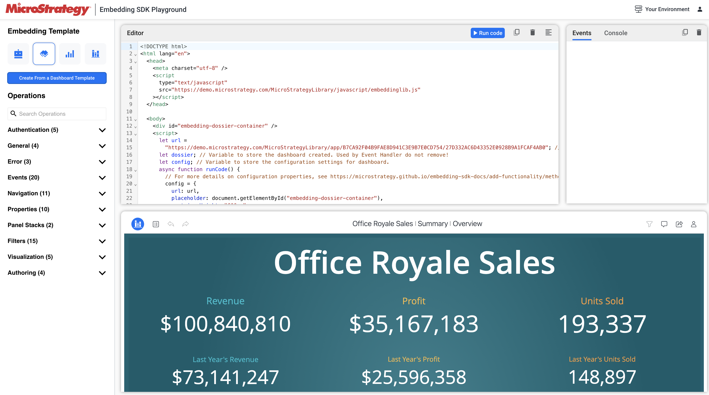

Strategy’s Embedding SDK Playground is the one-stop shop for developers to build impactful, interactive analytics experiences that integrate seamlessly with websites and applications.

Just use the intuitive drag-and-drop interfaces to define the perfect user experience, test it out in real time, and then let the platform automatically generate the code for you. You’ll turn your application into platform for Intelligence Everywhere in no time.

Start building your application using the [Embedding SDK Playground](https://microstrategy.github.io/playground/). The [Playground User Manual](https://github.com/MicroStrategy/playground) provides the instructions for how to get started.

There are four types of embedding use cases in [Embedding SDK Playground](https://microstrategy.github.io/playground/): Bot, Dashboard, Visualization, and Library. For each type, corresponding operations and examples are filtered and displayed when the embedding type is selected.

## Examples in playground

You can view examples in the Embedding SDK Playground by opening the Examples Gallery from "Start Over" button. Please save your work before opening an example.

Here are some examples in the gallery so far.

| Dashboard Example                                                                     | Use Case                                                                                                                                                                      |
| :------------------------------------------------------------------------------------ | :---------------------------------------------------------------------------------------------------------------------------------------------------------------------------- |
| [Simple Dashboard Example](https://microstrategy.github.io/playground/?example=g1)    | How to embed a dashboard.                                                                                                                                                     |
| [Minimal Template](https://microstrategy.github.io/playground/?example=g2)            | A template for the least amount code needed to embed a dashboard.                                                                                                             |
| [Responsive Height](https://microstrategy.github.io/playground/?example=g3)           | JavaScript code to make the height responsive.                                                                                                                                |
| [Dashboard in Full Screen](https://microstrategy.github.io/playground/?example=g4)    | How to show embedded dashboard in full screen.                                                                                                                                |
| [Inter-dashboard interaction](https://microstrategy.github.io/playground/?example=g5) | Interaction between embedded dashboard. One dashboard filters another.                                                                                                        |
| [Filters](https://microstrategy.github.io/playground/?example=g6)                     | Various examples to show how to use filter-related API. It covers attribute selector filter, attribute search, attribute slider, calendar, metric qualification filters, etc. |
| [Page Navigation](https://microstrategy.github.io/playground/?example=g14)            | How to use page navigation API.                                                                                                                                               |
| [Single Visualization](https://microstrategy.github.io/playground/?example=g15)       | How to embed a single visualization.                                                                                                                                          |
| [Authoring](https://microstrategy.github.io/playground/?example=g16)                  | How to embed dashboard in authoring mode.                                                                                                                                     |
| [Authentication](https://microstrategy.github.io/playground/?example=g17)             | How to implement SAML/OIDC/Guest/Standard authentication.                                                                                                                     |
| [Export to Excel or PDF](https://microstrategy.github.io/playground/?example=g18)     | How to export dashboard to excel or PDF.                                                                                                                                      |
| [Prompts](https://microstrategy.github.io/playground/?example=g20)                    | Various examples to show how to answer prompts.                                                                                                                               |
| [Interact with Panel Stacks](https://microstrategy.github.io/playground/?example=g23) | How to use panel-related API.                                                                                                                                                 |

| Bot Example                                                                             | Use Case                                             |
| :-------------------------------------------------------------------------------------- | :--------------------------------------------------- |
| [Embed Bot Page Example](https://microstrategy.github.io/playground/?example=g25)       | How to embed a MSTR chat bot.                        |
| [Embed Bot From Embedding API](https://microstrategy.github.io/playground/?example=g26) | How to embed a customized chatbot from embedding api |

| Visualization Example                                                           | Use Case                                                  |
| :------------------------------------------------------------------------------ | :-------------------------------------------------------- |
| [Embed Visualizations](https://microstrategy.github.io/playground/?example=g28) | How to embed native visualizations from a given dashboard |

| Library Example                                                                 | Use Case                  |
| :------------------------------------------------------------------------------ | :------------------------ |
| [Embed Visualizations](https://microstrategy.github.io/playground/?example=g24) | How to embed MSTR Library |
