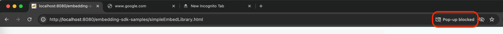
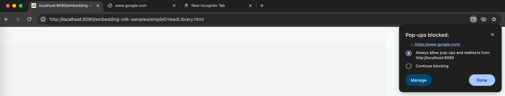
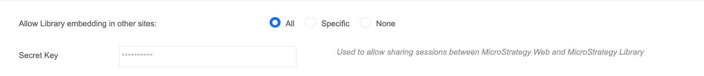

The example in this topic illustrates how to display an embedded dashboard using SAML authentication. The same code works for OIDC except the `loginMode` parameter.

A live example can be seen on [GitHub](https://microstrategy.github.io/playground/?example=g17). Also check out [other examples](https://microstrategy.github.io/playground).

## The workflow

Here is the workflow of the example.

1. Client Application checks if auth token is still valid. If yes, jumps to Step 4.

1. Client Application opens the MicroStrategy Library Web login page (`https://[Your MicroStrategy Environment]/MicroStrategyLibrary/auth/login-dialog.jsp`) in a new tab. The login page will be responsible for showing a login dialog.

1. After the user finishes logging in, the login page will send a JavaScript message to inform the Client Application.

1. The Client Application gets the message, fetches the auth token, and uses it to make REST API calls or uses it in MicroStrategy’s Embedding SDK.

You may encounter some difficulties in this workflow:

- The MicroStrategy Library Web login page couldn't be opened in a new tab.
  - This might be caused by your Chrome site settings doesn't allow pop-ups.
  - In this case, you will see an icon on the right of location bar, which notifies you the pop-ups are blocked:
    
    You need to unblock the pop-ups like this:
    
- The user finishes logging in, but the Client Application doesn't proceed. The MicroStrategy Library Web login page isn't closed and the embeded dossier doesn't show.
  - This might be caused by your strict CSP settings. If your [COOP](https://developer.mozilla.org/en-US/docs/Web/HTTP/Headers/Cross-Origin-Opener-Policy)(Cross-Origin-Opener-Policy) setting is [same-origin](https://developer.mozilla.org/en-US/docs/Web/HTTP/Headers/Cross-Origin-Opener-Policy#same-origin), the MicroStrategy Library Web login page can't get the Client Application window so can't send messages to it.
  - In this case, you need to change your COOP setting to [unsafe-none](https://developer.mozilla.org/en-US/docs/Web/HTTP/Headers/Cross-Origin-Opener-Policy#unsafe-none), which is the default value. Then the login process will work.

## For MicroStrategy 2024 Update 6 or after

In MicroStrategy 2024 Update 6, we add the [partitioned cookie change](../config#the-partitioned-cookie-change) to enable the customer to use the Embedding SDK even if third-party cookies are blocked. But if third-party cookies are blocked, the old SAML or OIDC login process can't work.

You can unblock the third-party cookies manually to support the old workflow, but we recommend you use the new [embedding auth APIs](../support-for-different-authentication-environments/new-authentication-apis.md), which can work in the third-party cookies blocked case, and simplify the SAML or OIDC login logic. You can see the examples in the [playground](https://microstrategy.github.io/playground/?example=g17). A simple code piece would be like this:

```js
microstrategy.embeddingContexts.embedLibraryPage({
  serverUrl: "{YOUR_LIBRARY_SERVER_URL}",
  placeholder: document.getElementById("LibraryHomePageContainer"),
  enableCustomAuthentication: true,
  customAuthenticationType: microstrategy.dossier.CustomAuthenticationType.AUTH_TOKEN,
  getLoginToken: () => microstrategy.auth.samlLogin("{YOUR_LIBRARY_SERVER_URL}"),
});
```

The new API [microstrategy.auth.samlLogin(serverUrl)](./new-authentication-apis#microstrategyauthsamlloginserverurl) or [microstrategy.auth.oidcLogin(serverUrl)](./new-authentication-apis#microstrategyauthoidcloginserverurl) creates an identity token to share the sessions, so you must ensure you have a secret key to create identity tokens first. You can check it in the Library settings here:



The secret key must have its content here.
