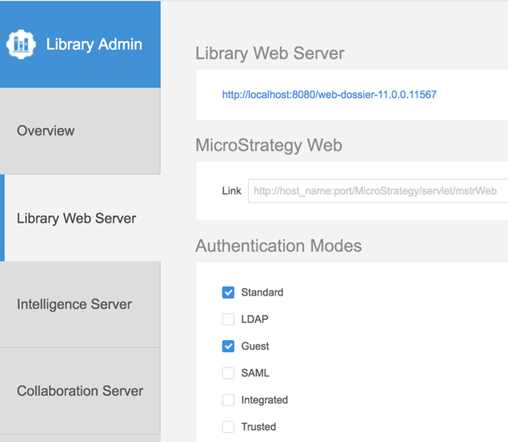

The example in this topic illustrates how to seamlessly display an embedded dossier using Guest authentication when multiple authentication modes are enabled.

## Set up Library Server

Enable Guest and other authentications in MicroStrategy Library Admin.



## Configure the example

1. A live example can be seen on [GitHub](https://microstrategy.github.io/embedding-sdk-samples/feature_showcase/1_2_Guest_With_MultiAuth.html). Also check out [other examples](https://microstrategy.github.io/embedding-sdk-samples/).

   ```html
   <!DOCTYPE html>
   <html lang="en">
     <head>
       <meta charset="UTF-8" />
       <title>GuestLoginExample</title>
       <script type="text/javascript" src="https://demo.microstrategy.com/MicroStrategyLibraryDev/javascript/embeddinglib.js"></script>
     </head>
     <body>
       <div id="mydossier"></div>

       <script type="text/javascript">
         var baseURL = "https://demo.microstrategy.com/MicroStrategyLibraryDev";
         var projectId = "EC70648611E7A2F962E90080EFD58751";
         var dossierId = "837B57D711E941BF000000806FA1298F";
         function login() {
           var options = {
             method: "POST",
             credentials: "include", // Including cookie
             mode: "cors", // Setting as cors mode for cross origin
             headers: { "Content-Type": "application/json" },
             body: JSON.stringify({
               loginMode: 8, // Login as guest user.
             }),
           };
           return fetch(baseURL + "/api/auth/login", options)
             .then(function (response) {
               if (response.ok) {
                 return response.headers.get("x-mstr-authToken");
               } else {
                 response.json().then(function (json) {
                   console.log(json);
                 });
               }
             })
             .catch(function (error) {
               console.log(error);
             });
         }

         document.addEventListener("DOMContentLoaded", function () {
           var placeHolderDiv = document.getElementById("mydossier");
           var dossierUrl = baseURL + "/app/" + projectId + "/" + dossierId;
           microstrategy.dossier.create({
             placeholder: placeHolderDiv,
             url: dossierUrl,
             enableCustomAuthentication: true,
             enableResponsive: true,
             customAuthenticationType: microstrategy.dossier.CustomAuthenticationType.AUTH_TOKEN,
             getLoginToken: login,
           });
         });
       </script>
     </body>
   </html>
   ```

1. To use a dossier from your Library Server, make the following changes to the code:

   1. Configure the path to the Embedding SDK javascript file, replacing `https://demo.microstrategy.com/MicroStrategyLibraryDev` with your Library Server URL.

      ```html
      <script type="text/javascript" src="https://demo.microstrategy.com/MicroStrategyLibraryDev/javascript/embeddinglib.js"></script>
      ```

      The `embeddinglib.js` file, which contains the Embedding SDK, is included in the `MicroStrategyLibrary` web application.

   1. Configure variables to set the values for the path to the MicroStrategy Library installation, the project ID, and the dossier ID.

      - Set the value of the `baseURL` variable to the path to your MicroStrategy Library by replace `https://demo.microstrategy.com/MicroStrategyLibraryDev` with your Library Server URL.

        ```js
        var baseURL = "https://demo.microstrategy.com/MicroStrategyLibraryDev";
        ```

      - Set the value of the `projectId` variable to the ID for the project containing the dossier you want to embed.

        ```js
        var projectId = "EC70648611E7A2F962E90080EFD58751";
        ```

      - Set the value of the `dossierId` variable to the ID of the dossier you want to embed.

        ```js
        var dossierId = "837B57D711E941BF000000806FA1298F";
        ```

      :::tip

      You can obtain the project ID and dossier ID by running the dossier in MicroStrategy Library and copying the URL.

      :::

1. Once you have configured the code, save your HTML file and open it in a browser. The embedded dossier is seamlessly displayed in the browser.

:::tip

If the dossier does not render on the page, you can use the browser developer tools to review any exceptions or errors being thrown. When you make an XHR request for `POST /auth/login`, you only need to wait until the response headers are returned. The expected status code will be 204 (Success no content). Review [the documentation on `XMLHTTPRequest.readyState`](https://developer.mozilla.org/en-US/docs/Web/API/XMLHttpRequest/readyState) to understand what is necessary to obtain the request header.

:::
