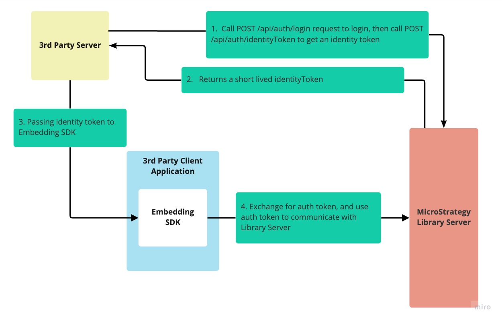
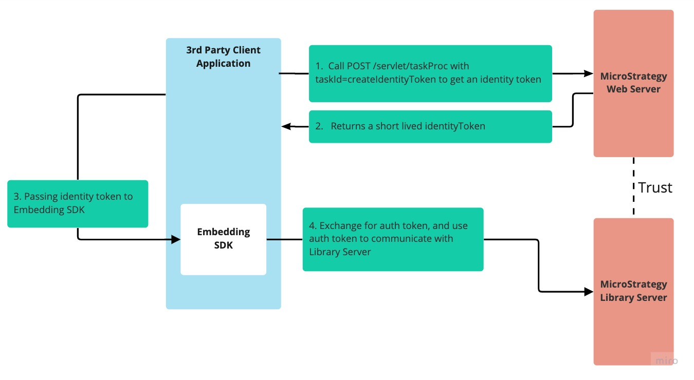

When you embed a MicroStrategy dashboard in your application, you can provide a seamless login experience for users who are already authenticated on your server so that they don't have to authenticate again on the MicroStrategy Server.

For example, assume that a user is already authenticated with a third-party server and this 3rd-party server is managing the user credentials so that it can authenticate with other applications on the user's behalf. (The third-party server is responsible for securing the data and initiating authentication on HTTPS.) If a user has already logged into MicroStrategy Web, you can also get an identity token using MicroStrategy Task API.

MicroStrategy Embedding SDK supports [identity token](../add-functionality/methods-and-properties.md#customauthenticationtype) as a custom authentication type.

## Getting identity token from Library Server

The authentication workflow is the following:

1. The third-party application server logs in, invoking the REST API login endpoint (`POST /api/auth/login`) and providing the user's credential information.
1. Once the user is logged in, the identity token can be retrieved with the authorization token, using `POST /api/auth/identityToken`. The MicroStrategy Library Server returns an identity token to the caller in the response header. The identity token has a very short duration.
1. The client provides the identity token to the Embedding SDK, which is used for embedding a dashboard.
1. The SDK will exchange the identity token for an authorization token and use the authorization token to communicate with the Library Server in the subsequent requests.

:::tip

A live example can be seen on [GitHub](https://microstrategy.github.io/embedding-sdk-samples/feature_showcase/3_Use_IdentityToken.html), which shows how to pass the identity token to Embedding SDK. Also check out [other examples](https://microstrategy.github.io/embedding-sdk-samples/).

:::

## Getting identity token from MicroStrategy Web

If your user has already logged into MicroStrategy Web, you can get identity token from MicroStrategy Web and use the identity token in Embedding SDK.

The authentication workflow is the following:

1. User has already logged into MicroStrategy Web. The client application calls `createIdentityToken` task. `POST /servlet/taskProc` with `taskId=createIdentityToken&taskContentType=json&taskEnv=xhr` in payload. See [Web SDK](https://www2.microstrategy.com/producthelp/Current/WEBSDK/Content/topics/taskinfr/TI_QuickStartGuide_UseTasks.htm) for how to use tasks.
1. The MicroStrategy Web returns an identity token to the caller in the response body. The identity token has a very short duration.
1. The client application provides the identity token to the Embedding SDK, which is used for embedding a dashboard.
1. The SDK will exchange the identity token for an authorization token and use the authorization token to communicate with the Library Server in the subsequent requests.

:::tip

You need to enable seamless login between MicroStrategy Web and Library to use this workflow. See [this document](https://www2.microstrategy.com/producthelp/current/InstallConfig/en-us/Content/enable_seamless_login_web_library.htm) for details.

:::
