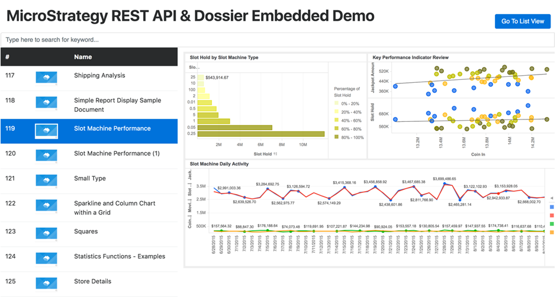

You can create a workflow that combines REST APIs and the JavaScript Embedding SDK. We have provided a sample that illustrates how to use REST APIs to authenticate and search for documents in a specific folder, and then use the JavaScript Embedding SDK to embed a document selected from the search results, as a MicroStrategy dossier, in a web application.

The following sections help you understand and use the sample.

## Understand the API Workflow

This sample uses REST APIs to authenticate a user, get all the projects the user has access to, get all the pre-defined folders for one of these projects, and search for all the documents in one of these folders. It uses the JavaScript Embedding SDK to embed one of the documents in the search results in a web page, as a dossier. The workflow for this sample is shown below:

1. `POST /auth/login`

   This REST API authenticates a user. It creates a MicroStrategy session using credentials for the user, a specified authentication mode, and other information passed in the body of the request. It returns an authorization token (`authToken`), which is then used by subsequent REST API calls. In this sample, standard authentication mode is used to create a configuration session.

1. `GET /projects`

   This REST API returns the list of projects that the authenticated user has access to, based on the authorization token that is passed in. In this sample, the API returns all the projects the authenticated user can access on a specified Intelligence Server.

1. `GET /folders`

   This REST API returns a list of all pre-defined folders, such as the Public Objects folder, in a specified project. The authorization token and a project ID are passed in. In this sample, the API returns all the pre-defined folders in the MicroStrategy Tutorial project by default.

1. `GET /searches/results`

   This REST API returns a list of search results based on the stored results of the Quick Search engine. The Quick Search Engine periodically indexes the metadata and stores the results in memory, making Quick Search very fast but with results that may not be the most recent. The authorization token and a folder ID or name are passed in. In this sample, the API is used to find all of the documents in the Public Objects folder by default.

1. `microstrategy.dossier.create`

   This javascript API is used to embed a dossier into a web page. In this sample, the documents returned by the `GET /searches/results` REST API are listed on the left side of the web page. When the user clicks a document in the list, it is embedded as a dossier in the right pane of the web page.

Set Up the Sample

## To set up the sample

1. [Download the zipped sample](https://www2.microstrategy.com/producthelp/2021/downloads/EmbeddingSDK/EmbeddingAPIWorkflowSample.zip) and extract the EmbeddingAPIWorkflowSample folder and its contents to your application server. For example, if you are using Tomcat, you would extract the EmbeddingAPIWorkflowSample folder and its contents to the Tomcat `webapps` folder.

   |The sample needs to be placed in the same location where MicroStrategyLibrary is deployed.

1. The EmbeddingAPIWorkflowSample folder contains HTML files, javascript files, image files, and a CSS file. The main HTML page for the sample is called `app.html`. The javascript file used to configure the sample is called `controller.js`.
1. [Configure the sample](#configure-the-sample) for your environment, as described below.
1. Open the sample using either the administrator page of your application server, such as Tomcat Manager, or a URL like the one shown below:

   `http://localhost:8080/EmbeddingAPIWorkflowSample/app.html`

1. [Use the sample](#use-the-sample) by modifying the search and selecting different documents.

## Configure the Sample

You need to configure `app.html` and `controller.js`.

- The `app.html` file is the opening page of the sample. You need to configure it to point to your Library Server.

  1. Open `app.html` in a text editor.
  1. Find the following `<script>` tag and configure it to point to your MicroStrategy Library installation.

  ```html
  <!--Include embedded SDK library. For example -->
  <script src="http://localhost:8080/MicroStrategyLibrary/javascript/embeddinglib.js"></script>
  ```

  1. Save your changes.

- The `controller.js file` is used to configure the sample for your environment. Use the following variables to configure the Library Server, project, folder, user credentials, and number of documents to display on the page.

  | Variable name               | Variable description                                                                                                                                                                                                                                                                                                                                                                                             |
  | --------------------------- | ---------------------------------------------------------------------------------------------------------------------------------------------------------------------------------------------------------------------------------------------------------------------------------------------------------------------------------------------------------------------------------------------------------------- |
  | `BASE_URL`                  | Base URL of the MicroStrategy REST API. For example, `http://localhost:8080/MicroStrategyLibrary/api`. The REST API endpoints will be appended to this base URL. <br/><blockquote>This must be the same machine as the one in the `projectURL`.</blockquote>                                                                                                                                                     |
  | `projectURL`                | URL that points to the MicroStrategy Library home page. For example, `http://localhost:8080/MicroStrategyLibrary/app` <br/> <blockquote>This must be the same machine as the one in `the BASE_URL`.</blockquote>                                                                                                                                                                                                 |
  | `PROJECT_ID / PROJECT_NAME` | You can specify the project using either the object ID of the project or the project name. If you specify both the project ID and the project name, the project ID is used. In this sample, if you do not specify either the project ID or project name, the default project, "MicroStrategy Tutorial", is used.<br/><blockquote>If you use the `PROJECT_ID`, you must enclose it in single quotes.</blockquote> |
  | `FOLDER_ID / FOLDER_NAME`   | You can specify the folder using either the object ID or the name of the folder. If you specify both the folder ID and the folder name, the folder ID is used. In this sample, if you do not specify either the folder ID or the folder name, the default folder, "Public Objects", is used.<br/><blockquote>If you use the `FOLDER_ID`, you must enclose it in single quotes.</blockquote>                      |
  | `USERNAME`                  | Username you want to be authenticated with. The default value is "administrator".                                                                                                                                                                                                                                                                                                                                |
  | `PASSWORD`                  | Password for username you want to be authenticated with.                                                                                                                                                                                                                                                                                                                                                         |
  | `NUM_OF_DOCS_TO_DISPLAY`    | Maximum number of documents that can be displayed on the page. In this sample, if you do not specify a value for this variable, the default value of "200" is used.                                                                                                                                                                                                                                              |

## Use the Sample

Initially, all of the documents in the MicroStrategy Tutorial project under the Public Objects folder are displayed on the left side of the web page. Users can use the search bar to narrow down the documents that are displayed. In the search results, they can look for a particular document and select it. The document that is selected is then opened and displayed on the right side of the page as an embedded dossier. If users want to see detailed information about the document, they can click the **Go To List View** button.


