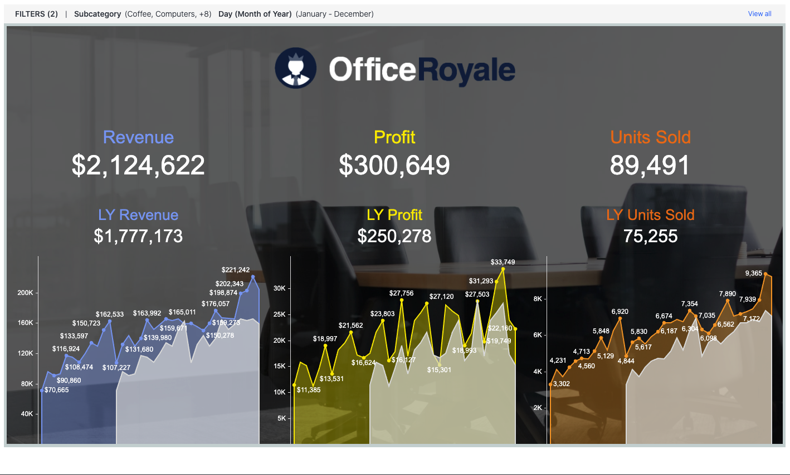

The JavaScript Embedding SDK allows you to quickly integrate dossiers into a web application in a responsive manner. The code required for the dossier to be displayed without requesting credentials depends on the how authentication is configured for the environment where the embedded dossier is hosted. The sample in this topic illustrates how to seamlessly display an embedded dossier using Guest authentication when Guest is the only authentication mode that is enabled.

To help you get started, we have provided a downloadable sample with the required code. By design, the code in this sample only shows how to embed a dossier and nothing else, and it embeds an existing dossier from the MicroStrategy Library demo site, which has only Guest authentication enabled.

You can use this sample "as is", without making any changes, or you can customize it. We have provided simple instructions and code snippets to help you configure the sample for your environment---using your web server and a dossier from your environment. If you customize the sample, however, you must configure your environment to support only Guest authentication in order for the dossier to display seamlessly.

A live example can be seen on [GitHub](https://microstrategy.github.io/embedding-sdk-samples/feature_showcase/1_No_Authentication.html). Also check out [other examples](https://microstrategy.github.io/embedding-sdk-samples/).

```html
<!DOCTYPE html>
<html lang="en">
  <head>
    <meta charset="UTF-8" />
    <title></title>
    <script type="text/javascript" src="https://demo.microstrategy.com/MicroStrategyLibrary/javascript/embeddinglib.js"></script>
  </head>
  <body onload="load()">
    <div id="mydossier"></div>
    <script type="text/javascript">
      document.addEventListener("DOMContentLoaded", function () {
        var container = document.getElementById("mydossier");
        var url = "https://demo.microstrategy.com/MicroStrategyLibrary/app/EC70648611E7A2F962E90080EFD58751/837B57D711E941BF000000806FA1298F";

        microstrategy.dossier.create({
          url: url,
          enableResponsive: true,
          placeholder: container,
          containerHeight: "800px",
        });
      });
    </script>
  </body>
</html>
```

Open the page in a browser to view the embedded dossier. You should see the dossier shown below.



> Because this simple embedding sample uses a dossier on the demo server, you are not prompted for credentials. However, when you use a dossier in your environment, you will be prompted for credentials unless you enable single sign-on. In the other topics, you will learn how to enable single sign-on.

**To customize the sample to use your MicroStrategy Library Server**:

1. Decide where you want to have the HTML page. If the domain is different from your MicroStrategy Library Server's domain, you may need to [perform additional configuration to support Cross-Origin Requests (CORS)](../config).

2. In an IDE or text editor, open the HTML file and configure it to reflect the values in your environment:

   - Set the value of the `src` attribute in the first `<script>` node to the path to your MicroStratetgy Library installation. Replace `demo.microstrategy.com` with your server path.

     ```html
     <script type="text/javascript" src="https://demo.microstrategy.com/MicroStrategyLibrary/javascript/embeddinglib.js"></script>
     ```

     The `embeddinglib.js` file, which contains the Embedding SDK, is included in the MicroStrategyLibrary web application.

   - Set the value for url to reference a dossier in a project in your environment. First, replace `demo.microstrategy.com` with your server path and then replace `EC70648611E7A2F962E90080EFD58751/837B57D711E941BF000000806FA1298F` with your Project ID and Dossier ID.

     ```js
     url =
       "https://demo.microstrategy.com/MicroStrategyLibrary/app/EC70648611E7A2F962E90080EFD58751/837B57D711E941BF000000806FA1298F";
     ```

     > You can obtain the value of your Project ID and Dossier ID by running a dossier in MicroStrategy Library and copying the URL.

3. Once you have customized the code for your environment, save your HTML file. This file is a simple application with an embedded dossier.

4. Configure your environment so that only guest authentication is enabled.

   If guest authentication is the only authentication mode that is enabled, the application will open and the dossier will be displayed without asking for credentials. However, if multiple authentication modes are enabled, the dossier will not be displayed seamlessly. You need to add additional code that enables guest authentication. [Using guest authentication when there are multiple authentication modes](./multiple-modes) provides a simple sample and an explanation of how to add the necessary code.

5. Open the page URL in a browser. The embedded dossier should be displayed in the application.

:::tip

If the dossier does not render on the page, you can use the browser developer tools to review any exceptions or errors being thrown. When you make an XHR request for `POST /auth/login`, you only need to wait until the response headers are returned. The expected status code will be 204 (Success no content). Review [the documentation on `XMLHTTPRequest.readyState`](https://developer.mozilla.org/en-US/docs/Web/API/XMLHttpRequest/readyState) to understand what is necessary to obtain the request header.

:::
